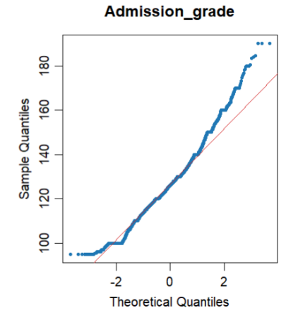
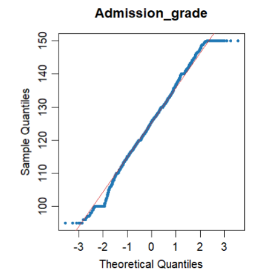
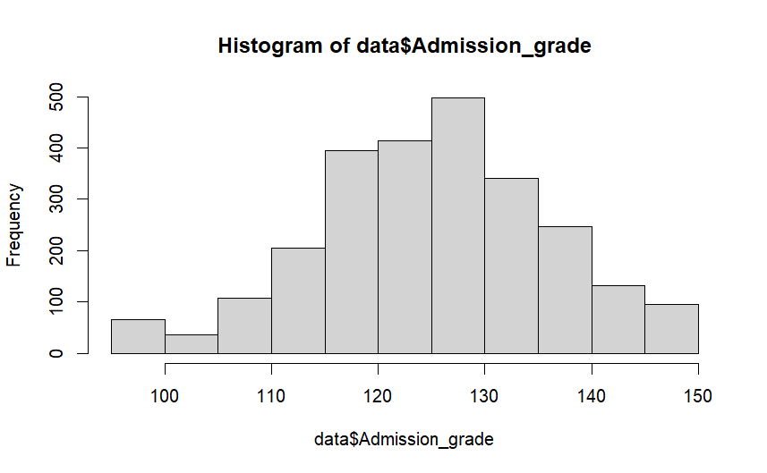
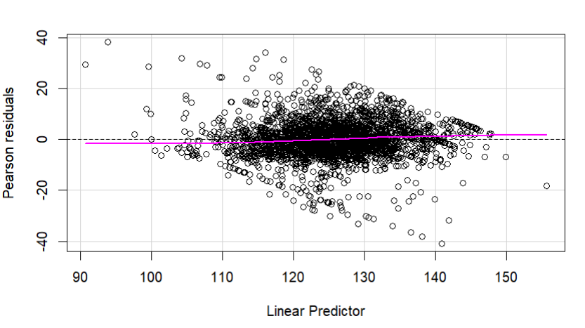
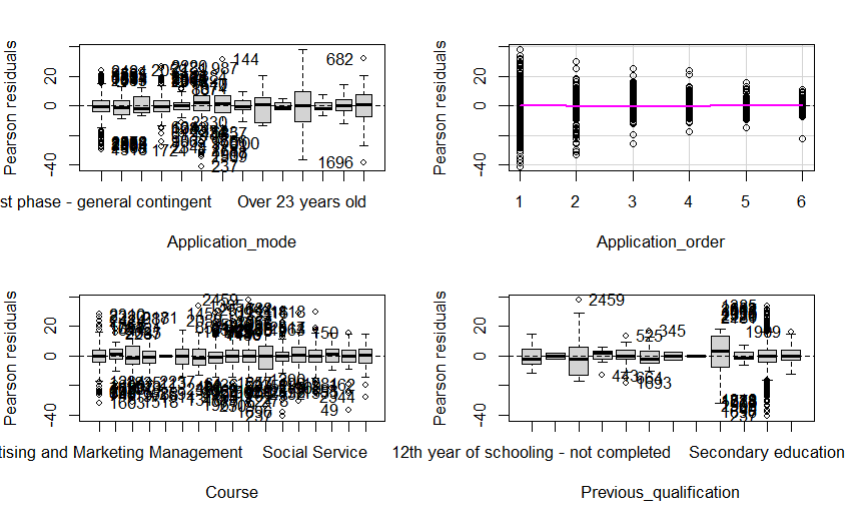
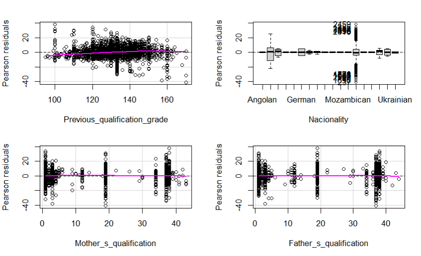
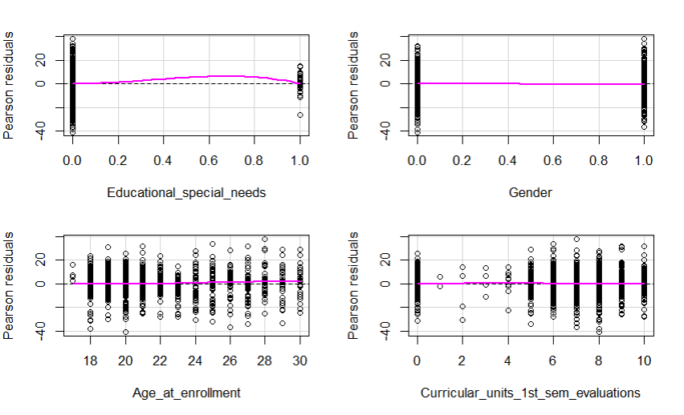
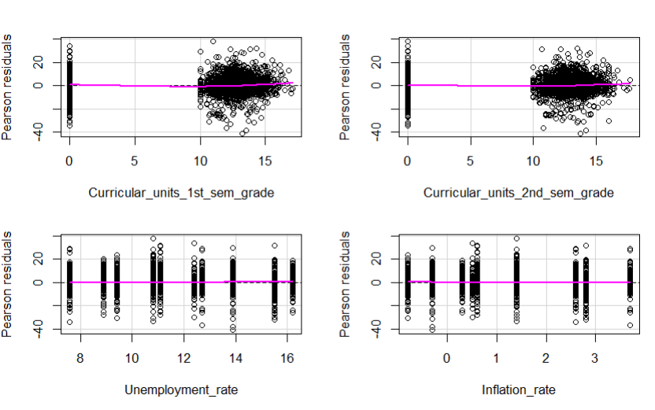

<style>
  /* Estils globals del document */
  body {
    font-family: Helvetica, Arial, sans-serif; /* Font Helvètica amb alternatives */
    font-size: 11pt; /* Reduït de la mida per defecte */
    text-align: justify; /* Text justificat */
    line-height: 1.4; /* Millor llegibilitat */
  }

  /* Paràgrafs justificats */
  p {
    text-align: justify;
    font-size: 11pt;
  }

  /* Títols més petits */
  h1 {
    font-size: 16pt;
    text-align: left; /* Els títols normalment van alineats a l'esquerra */
  }

  h2 {
    font-size: 14pt;
    text-align: left;
  }

  h3 {
    font-size: 12pt;
    text-align: left;
  }

  h4 {
    font-size: 11pt;
    text-align: left;
  }
  /* Contenidor principal per a la fila d'imatges */
  .image-row {
    display: flex;
    flex-wrap: wrap;
    justify-content: center;
    gap: 1.5rem; /* Espai entre imatges */
    margin-top: 1rem;
    margin-bottom: 1rem;
    align-items: flex-start; /* Alinea per la part superior */
  }

  /* Cada columna que conté una imatge i el seu text */
  .image-column {
    flex: 1 1 0; /* Permet que es distribueixin equitativament */
    min-width: 300px; /* Amplada mínima */
    max-width: 450px; /* Amplada màxima per defecte (múltiples imatges) */
    display: flex;
    flex-direction: column;
    align-items: center;
  }

  /* Quan només hi ha UNA imatge, que mantingui la seva mida original */
  .image-row:has(.image-column:only-child) .image-column {
    max-width: none; /* Elimina la restricció de mida màxima */
    flex: 0 0 auto; /* No creix ni s'encongeix */
  }

  /* Quan només hi ha UNA imatge, que no s'escali */
  .image-row:has(.image-column:only-child) .image-column img {
    width: 75%; /* Manté la mida original */
    max-width: 100%; /* Però no excedeix el contenidor si és massa gran */
  }

  /* Estils per a la imatge (múltiples imatges) */
  .image-column img {
    width: 100%;
    max-width: 100%;
    height: auto;
    display: block;
  }

  /* Estils per al peu de foto */
  .image-column .caption {
    margin-top: 0.5rem;
    font-size: 0.9em;
    text-align: center;
    color: #555;
  }

 /* Estil per a la separació de pàgines en PDF */
  .page-break {
      page-break-before: always;
      break-before: page;
    }

</style>

# INFORME D4

## 0. Taula de continguts

- [INFORME D4](#informe-d4)
  - [0. Taula de continguts](#0-taula-de-continguts)
  - [1. Preprocessament de les dades](#1-preprocessament-de-les-dades)
  - [2. Anàlisi exploratori](#2-anàlisi-exploratori)
  - [3. Ajustament d'un MLGz numèric](#3-ajustament-dun-mlgz-numèric)
    - [3.1 Selecció de variables](#31-selecció-de-variables)
    - [3.2 Validació del model](#32-validació-del-model)
  - [4. Ajustament d'un MLGz binari](#4-ajustament-dun-mlgz-binari)
  - [5. Sèries temporals](#5-sèries-temporals)

<div class="page-break"></div>

## 1. Preprocessament de les dades

Aquesta part correspon a l'script `preprocessing.rmd`. Als tres primers punts de l'script netegem noms de columnes, i recodifiquem múltiples variables a factors amb nivells i etiquetes coherents, després comprovem valors buits i duplicitats i generem un informe exploratori inicial amb `SmartEDA`, amb el qual ens guiarem a l’hora d’actuar als següents passos. També verifiquem files amb NA i files duplicades.

Al punt 4, eliminem *outliers*, basant-nos en el que hem pogut veure a l’informe general. En concret, es marquen:

- **Edat en el moment de la inscripció (Age_at_enrollment):** superior a 30 anys.
- **Ordre de sol·licitud (Application_order):** superior a 7.
- **Nota de la qualificació prèvia (Previous_qualification_grade):** superior a 170.
- **Nota d’admissió (Admission_grade):** superior a 150.
- **Nombre d’unitats curriculars (1r i 2n semestre):**
  - Matriculades (`*_enrolled`): superior a 10.
  - Avaluades (`*_evaluations`): superior a 10.
  - Aprovades (`*_approved`): superior a 10.

Aquest procés garanteix la coherència i la plausibilitat de les dades, eliminant valors inusuals o impossibles que podrien distorsionar les anàlisis posteriors. Per exemple, per la variable `Admission_grade`, hem pogut observar els següents canvis:

<div class="image-row">
  <div class="image-column">
    
    <p class="caption">Figura 1: Variable numèrica admisson_grade abans del preprocessament</p>
  </div>
  <div class="image-column">
    
    <p class="caption">Figura 2: Variable numèrica admisson_grade després del preprocessament</p>
  </div>
</div>

En el punt 5 i amb ajuda del nostre informe inicial, hem identificat diverses variables que representen quantitats discretes. Aquestes variables s’han transformat en variables categòriques amb valors compresos entre 0 i 10. Les variables afectades són les següents:

- `Application_order`
- `Curricular_units_1st_sem_enrolled`
- `Curricular_units_2nd_sem_enrolled`
- `Curricular_units_1st_sem_evaluations`
- `Curricular_units_2nd_sem_evaluations`
- `Curricular_units_1st_sem_approved`
- `Curricular_units_2nd_sem_approved`

També, hem processat les variables relacionades amb els crèdits i les avaluacions pendents per convertir-les en variables binàries (on qualsevol valor superior a 0 es codifica com "1"):

- `Curricular_units_1st_sem_credited`
- `Curricular_units_2nd_sem_credited`
- `Curricular_units_1st_sem_without_evaluations`
- `Curricular_units_2nd_sem_without_evaluations`

Aquests canvis permeten una millor interpretació i anàlisi de les dades, facilitant l’aplicació de tècniques estadístiques i models predictius que requereixen variables categòriques. Finalment, al punt 6, hem guardat el dataset netejat i preprocessat en un nou fitxer CSV anomenat `clean-data.csv`, que serà utilitzat per a les anàlisis posteriors.

## 2. Anàlisi exploratori

*cal canviar*
Quan mirem el conjunt de dades, veiem que hi ha diferents tipus de variables, algunes numèriques i d’altres categòriques. En general, les numèriques no segueixen del tot una forma “normal”, algunes tenen valors molt agrupats i d’altres tenen punts que surten bastant del que seria esperable. Els gràfics de densitat i els boxplots mostren que hi ha bastants valors atípics i que les distribucions són força diferents entre variables, cosa que indica que no totes representen la informació de la mateixa manera. En alguns casos, hi ha variables amb una dispersió molt alta i altres molt concentrades, cosa que pot complicar una mica les anàlisis o la creació de models. Pel que fa a les variables categòriques, podem veure que no estan gaire equilibrades. Hi ha algunes categories molt freqüents, mentre que en tenim d’altres que gairebé no apareixen. Això pot fer que els resultats no siguin del tot justos, perquè el model podria donar més importància a les categories que tenen més dades i passar per alt les que en tenen poques, creant un biaix que s'hauria de tenir en compte a l'hora de fer models o prediccions.

Quan mirem les relacions entre variables, podem veure que n’hi ha algunes que estan bastant relacionades. Els boxplots mostren diferències clares entre grups i els scatterplots deixen veure certs patrons que podrien ser útils més endavant. Tot això, ens fa pensar que hi ha variables amb una influència real sobre la variable resposta. En resum, el conjunt de dades és interessant, amb tendències clares i relacions útils, però també amb desequilibris i valors extrems que caldrà tenir en compte abans de fer models més avançats o prediccions.

## 3. Ajustament d'un MLGz numèric

El nostre objectiu és modelar i validar un model lineal generalitzat, amb `Admission_grade` com a resposta numèrica. Partim carregant les nostres dades netejades i preprocessades, assegurant-nos que totes les variables estan en el format correcte. Comencem fent un histograma de la variable resposta per entendre la seva distribució i identificar possibles transformacions necessàries amb la comanda `hist(data$Admission_grade)`:

<div class="image-row">
  <div class="image-column">
    
    <p class="caption">Figura 3: Histograma de la variable Admisssion_grade</p>
  </div>
</div>

Continuem fent un ajustament inicial d'un model lineal generalitzat amb la família gaussiana i el link identitat, utilitzant totes les variables excepte la variable ‘Target’. Aquest model ens servirà com a punt de partida per a la selecció de variables i l'avaluació del rendiment. El construïm el model amb la comanda següent:

```R
model <- glm(Admission_grade ~ . - Target, data = data, family = gaussian())
```

També construïm un model nul per tenir una referència bàsica i amb l'objectiu de comparar-lo amb el model complet. El model nul només inclou l'intercept i ens permet avaluar la millora que aporta el model amb totes les variables. El construïm amb la comanda següent:

```R
model_nul <- glm(Admission_grade ~ 1, data = data, family = gaussian)
```

Executem un test òmnibus o ANOVA per comparar el model complet amb el model nul, utilitzant `anova(model_nul, model, test="Chisq")`. Aquest test ens ajudarà a determinar si el model complet ofereix una millora significativa en la predicció de la variable resposta en comparació amb el model nul. Obtenim els resultats següents:

```bash
  Resid. Df Resid. Dev   Df Deviance  Pr(>Chi)    
1      2389     145767                            
2      2534     307211 -145  -161444 < 2.2e-16 ***
```

Veiem que el nostre model redueix la deviància en 161444 respecte el model nul, i el test de Chi-quadrat dona un p-valor extremadament petit. Això vol dir que el nostre model amb variables explicatives millora significativament l’ajust.

### 3.1 Selecció de variables

Per a començar a buscar el nostre model final, caldrà que eliminem les variables que no aporten informació rellevant i volem eliminar variables redundants, per quedar-nos amb un model més simple que s’ajusti de forma similar. Per això, ens guiarem amb els resultats que ens dona la pròpia construcció del model complet, on podem veure en consola les variables més explicatives i les que tenen menys pes, que són:

- Variables amb significació molt alta (***): `Application_mode`, `Course`, `Previous_qualification`, `Previous_qualification_grade`, `Age_at_enrollment`, `Unemployment_rate`.
- Variables amb significació alta (**): `Application_order`, `Curricular_units_1st_sem_evaluations`, `GDP`.

Aquest model l'anomenarem `model_1`, que, comparant-lo amb el model complet amb un altre test ANOVA, ens dóna els següents resultats:

```bash
  Resid. Df Resid. Dev  Df Deviance  Pr(>Chi)    
1      2489     155505                           
2      2389     145767 100   9738.5 0.0001416 ***
```

Podem plantejar les següents hipòtesis:

- **Hipòtesi nul·la $H_0$:** El model simple (`model_1`) és suficient. Les variables addicionals del model complet no milloren l'ajust de manera significativa.
- **Hipòtesi alternativa $H_1$:** El model complet (`model_complet`) ajusta les dades significativament millor que el model simple.

Els resultats mostren que l'augment de la deviància és de 9738.5 (que ja en si ens fa veure que les variables excloses en el model simplificat tenen, en conjunt, un poder explicatiu significatiu) amb un p-valor de 0.0001416, que és molt petit. Això ens porta a rebutjar l'hipòtesi nul·la i acceptar l'hipòtesi alternativa. Per tant, el model complet ajusta les dades significativament millor que el model simple. Descartem doncs, el model simple i seguim amb el model complet.

Però necessitem un model més senzill, així que seguim eliminant variables amb poca significació. El trobarem amb la funció `step()` de R, que ens ajuda a fer una selecció automàtica de variables basada en el criteri d'informació d'Akaike (AIC). Aquesta funció prova diferents combinacions de variables, afegint o eliminant-les, i selecciona el model que minimitza l'AIC, que és una mesura que equilibra la qualitat de l'ajust amb la complexitat del model. Així, podem trobar un model que sigui tant precís com senzill. Llavors, executem la comanda següent:
`model_final <- step(model, direction = "both")`

Aquest procés ens porta a un model final que anomenarem `model_final`, que inclou només les variables que aporten informació rellevant per predir `Admission_grade`. Aquest model és més manejable i interpretable, mantenint al mateix temps una bona capacitat predictiva. Un cop obtenim aquest model final, el comparem amb el model complet utilitzant un altre test ANOVA per veure si la simplificació ha afectat significativament l'ajust del model. Els resultats són els següents:

```bash
  Resid. Df Resid. Dev  Df Deviance Pr(>Chi)
1      2389     145767                      
2      2465     150821 -76  -5054.3   0.2768
```

També tornem a plantejar les següents hipòtesis:

- **Hipòtesi nul·la $H_0$:** El model final (`model_final`) és suficient. Les variables addicionals del model complet no milloren l'ajust de manera significativa.
- **Hipòtesi alternativa $H_1$:** El model complet (`model_complet`) ajusta les dades significativament millor que el model final.

Els resultats mostren que la reducció de la deviància és de -5054.3 amb un p-valor de 0.2768, que és molt gran. Això ens porta a no rebutjar l'hipòtesi nul·la. Per tant, el model final ajusta les dades de manera similar al model complet. Així doncs, acceptem el model final com a model definitiu per predir `Admission_grade`. I per acabar-nos-en d'assegurar, mirem la puntuació AIC dels dos models:

- **AIC del model complet:** 17759.37
- **AIC del model final:** 17693.77

Veiem que l'AIC del model final és menor que el del complet, la qual cosa reforça la nostra decisió d'escollir el model final. Un AIC més baix indica un millor equilibri entre l'ajust del model i la seva complexitat, fent que el model final sigui preferible per a la predicció de `Admission_grade`.

### 3.2 Validació del model

Per a la validació del nostre model, visualitzem diferents gràfics i els analitzem:

- **Gràfic de residus vs. valors ajustats:**
  Aquest gràfic ens ajuda a veure si hi ha algun patró en els residus. Si els residus estan distribuïts aleatòriament al voltant de zero, això indica que el model s'ajusta bé. Si veiem algun patró, podria indicar que el model no està capturant alguna relació important. Executem la comanda `residualPlot(model_final)`, de la llibreria `car` per generar aquest gràfic:

  <div class="image-row">
    <div class="image-column">
      
      <p class="caption">Figura 4: Gràfic de residus vs. valors ajustats</p>
      </div>
  </div>

  El gràfic de residus de Pearson contra el predictor lineal suggereix un ajust global raonable: la dispersió és força simètrica al voltant de 0 i la corba suau resta gairebé horitzontal, cosa coherent amb variància aproximadament constant en l’escala del link i absència de patrons forts visibles. Es detecten algunes observacions extremes i una lleugera inflexió als extrems de l’eix x, que podrien indicar petites no linealitats localitzades o efectes de límit, però no s’hi aprecia un patró en embut clar d’heteroscedasticitat. Amb aquestes observacions doncs, podem dir que el model sembla ajustar raonablement bé la major part de les dades.

- **Altres gràfics de residus:**
  Generem també gràfics addicional de residus contra cadascun dels predictors de primer ordre del model, utilitzant residus de tipus Pearson, per comprovar si hi ha algun patró específic relacionat amb alguna variable en particular. Utilitzem la comanda `residualPlots(model_final)` de la llibreria `car` per generar aquests gràfics:

  <div class="image-row">
    <div class="image-column">
      
      <p class="caption">Figura 5: Residus de Pearson varis</p>
    </div>

    <div class="image-column">
      
      <p class="caption">Figura 6: Residus de Pearson varis</p>
    </div>
  </div>

  <div class="image-row">
    <div class="image-column">
      
      <p class="caption">Figura 7: Residus de Pearson varis</p>
    </div>

    <div class="image-column">
      
      <p class="caption">Figura 8: Residus de Pearson varis</p>
    </div>
  </div>

  Pel que fa aquests gràfics, el patró global és compatible amb un ajust raonable del GLM: la línia suau es manté molt a prop de 0 en la majoria de panells i els residus es dispersen de manera bastant simètrica, sense evidència clara d’heteroscedasticitat en forma d’embut ni de curvatures marcades persistents. Podem concloure que:

  - Per les **variables contínues** de rendiment acadèmic: als panells de ``Curricular_units_1st_sem_grade``, ``Curricular_units_2nd_sem_grade`` i ``Previous_qualification_grade``, la línia suau resta propera a 0 i la nuvolositat és densa però sense tendències fortes; això suggereix que el link capta raonablement la relació mitjana amb aquestes covariables, malgrat alguns punts extrems que convé revisar com a potencials outliers.
  - Pels **indicadors macro** com ``Unemployment_rate``, ``Inflation_rate``: es veuen bandes verticals (per valors repetits) amb variància relativament estable i línia suau plana; no s’aprecien patrons sistemàtics de biaix en aquests predictors i, per tant, no hi ha senyals clares d’heteroscedasticitat associada al nivell d’aquests índexs.
  - Pels **factors categòrics grans** ``Application_mode``, ``Course``, ``Previous_qualification``, ``Nacionality``: la línia de referència es manté al voltant de 0 a la majoria de nivells; hi ha alguns grups amb pocs casos o dispersió desigual que mostren caixes més amples o valors atípics, però en general no es detecten patrons sistemàtics de desviació que indiquin problemes d’ajust.

  En resum, els gràfics no revelen violacions greus; el model sembla ben especificat en l’escala del link, amb possibles millores menors centrades en la gestió d’outliers.

- **InfluencePlot de la llibreria `car`¨**: La llibreria `car` també ofereix la funció `influencePlot()` per visualitzar l'impacte de les observacions individuals en el model. Aquest gràfic ens dona 3 mesures clau: l’eix x són els hat values, és a dir, l’apalancament de cada observació; l’eix y són els residus estandarditzats; i la mida dels punts representa la distància de Cook, que mesura l’efecte global d’eliminar una observació en els paràmetres del model. Executem la comanda `influencePlot(model_final)` per generar aquest gràfic:

  <div class="image-row">
    <div class="image-column">
      
      <p class="caption">Figura 9: Influence Plot del model final</p>
    </div>
  </div>

  La majoria d’observacions tenen leverage molt baix (hat-value pròxim a 0) i residus dins de l’interval $[−2,2]$, per tant no són problemàtiques ni per error ni per palanca, és a dir, la combinació de predictors d’aquella observació és “central” dins el núvol de dades
  Un grup petit de punts apareix cap a hat-values entre $0.2$ i $0.6$ amb residus moderats; aquestes bombolles són més grans, indicant distància de Cook més alta i, per tant, potencial influència sobre els coeficients del model.
  Els punts etiquetats: 2459, 859, 1608, 237, han superat algun llindar “noteworthy” en residu, leverage o Cook’s D i, per això, el car els marca automàticament; aquests són candidats prioritaris a revisió del registre, valors extrems o combinacions inusuals de predictors.
  Tot així, cap d’aquests punts no té un leverage extremadament alt (per exemple, $>0.8$) ni residus fora de l’interval $[−4,4]$, per tant no semblen ser influències desproporcionades que distorsionin greument l’ajust global del model.

Per tant, com a conclusió de la validació, el model sembla ajustar bé les dades sense violacions greus dels supòsits. Hi ha algunes observacions amb certa influència que convé revisar, però en general el model és robust i adequat per a la predicció de `Admission_grade`.

## 4. Ajustament d'un MLGz binari

## 5. Sèries temporals
