<style>
  /* Estils globals del document */
  body {
    font-family: Helvetica, Arial, sans-serif; /* Font Helvètica amb alternatives */
    font-size: 13pt; /* Reduït de la mida per defecte */
    text-align: justify; /* Text justificat */
    line-height: 1.4; /* Millor llegibilitat */
  }

  /* Paràgrafs justificats */
  p {
    text-align: justify;
    font-size: 11pt;
  }

  /* Títols més petits */
  h1 {
    font-size: 16pt;
    text-align: left; /* Els títols normalment van alineats a l'esquerra */
  }

  h2 {
    font-size: 14pt;
    text-align: left;
  }

  h3 {
    font-size: 12pt;
    text-align: left;
  }

  h4 {
    font-size: 11pt;
    text-align: left;
  }
  /* Contenidor principal per a la fila d'imatges */
  .image-row {
    display: flex;
    flex-wrap: wrap;
    justify-content: center;
    gap: 1.5rem; /* Espai entre imatges */
    margin-top: 1rem;
    margin-bottom: 1rem;
    align-items: flex-start; /* Alinea per la part superior */
  }

  /* Cada columna que conté una imatge i el seu text */
  .image-column {
    flex: 1 1 0; /* Permet que es distribueixin equitativament */
    min-width: 300px; /* Amplada mínima */
    max-width: 400px; /* Amplada màxima per defecte (múltiples imatges) */
    display: flex;
    flex-direction: column;
    align-items: center;
  }

  /* Quan només hi ha UNA imatge, que mantingui la seva mida original */
  .image-row:has(.image-column:only-child) .image-column {
    max-width: none; /* Elimina la restricció de mida màxima */
    flex: 0 0 auto; /* No creix ni s'encongeix */
  }

  /* Quan només hi ha UNA imatge, que no s'escali */
  .image-row:has(.image-column:only-child) .image-column img {
    width: 75%; /* Manté la mida original */
    max-width: 100%; /* Però no excedeix el contenidor si és massa gran */
  }

  /* Estils per a la imatge (múltiples imatges) */
  .image-column img {
    width: 100%;
    max-width: 100%;
    height: auto;
    display: block;
  }

  /* Estils per al peu de foto */
  .image-column .caption {
    margin-top: 0.5rem;
    font-size: 0.8em;
    text-align: center;
    color: #555;
  }

 /* Estil per a la separació de pàgines en PDF */
  .page-break {
      page-break-before: always;
      break-before: page;
    }

   /* Bloc imatge-esquerra / text-dreta */
  .media-row {
    display: flex;
    gap: 1.5rem;
    align-items: flex-start;     /* alineació superior */
    margin: 1rem 0;
  }
  .media-image {
    flex: 0 0 38%;               /* amplada columna imatge */
    max-width: 300px;            /* límit opcional */
    display: flex;
    flex-direction: column;
    align-items: center;
  }
  .media-image img {
    width: 100%;
    height: auto;
    display: block;
  }
  .media-image .caption {
    margin-top: 0.5rem;
    font-size: 0.8em;
    text-align: center;
    color: #555;
  }
  .media-text {
    flex: 1 1 0;                 /* columna de text ocupa la resta */
    min-width: 240px;
  }
  
  @page {
    @bottom-center {
      content: "Pàgina " counter(page) " de " counter(pages);
      font-size: 10pt;
      color: #555;
    }
}

</style>

## 0. Taula de continguts

- [0. Taula de continguts](#0-taula-de-continguts)
- [1. Introducció](#1-introducció)
- [2. Dades del problema](#2-dades-del-problema)
- [3. Pla de treball](#3-pla-de-treball)
- [4. Objectius i metodologia](#4-objectius-i-metodologia)
- [5. Preprocessament de les dades](#5-preprocessament-de-les-dades)
- [6. Anàlisi exploratori](#6-anàlisi-exploratori)
- [7. Ajustament d'un MLGz numèric](#7-ajustament-dun-mlgz-numèric)
  - [7.1 Selecció de variables](#71-selecció-de-variables)
  - [7.2 Validació del model](#72-validació-del-model)
- [8. Ajustament d'un MLGz binari](#8-ajustament-dun-mlgz-binari)
  - [8.1 Diagnòstic i solució de separació](#81-diagnòstic-i-solució-de-separació)
  - [8.2 Ajustament del model inicial](#82-ajustament-del-model-inicial)
  - [8.3 Validació del model](#83-validació-del-model)
  - [8.4 Possibles millores](#84-possibles-millores)
    - [8.4.1 Dades agregades per binomis](#841-dades-agregades-per-binomis)
    - [8.4.2 Model amb dues pendents](#842-model-amb-dues-pendents)
    - [8.4.3 Link probit](#843-link-probit)
    - [8.5 Corba ROC i AUC](#85-corba-roc-i-auc)
- [9. Sèries temporals](#9-sèries-temporals)
  - [9.1 Introducció](#91-introducció)
  - [9.2 Anàlisi exploratori](#92-anàlisi-exploratori)
  - [9.3 Transformacions](#93-transformacions)
    - [9.3.1 Canvi d'escala](#931-canvi-descala)
    - [9.3.2 Diferència estacional](#932-diferència-estacional)
  - [9.4 Proposta de valors per el model](#94-proposta-de-valors-per-el-model)
  - [9.5 Validació del model](#95-validació-del-model)
  - [9.6 Predicció](#96-predicció)

<div class="page-break"></div>

## 1. Introducció

En aquest projecte, hem decidit treballar amb la base de dades *Predict Students’ Dropout and Academic Success*, perquè volem aprofundir en l’abandonament i l’èxit acadèmic a la universitat, un tema que considerem d’especial interès, no només pel fet que ens toca de ben a prop, sinó també, perquè tenint en compte les pautes d’aquest projecte, aconseguirem un model que ens pugui predir, de manera força fiable, quin perfil d’estudiant hauria de deixar o acabar una carrera universitària. Aquest aspecte del treball és el que més ens ha motivat a escollir aquest perfil de dataset. En concret, aquest dataset està format per més de 4000 registres d’estudiants universitaris i prop de quaranta variables demogràfiques, socials i acadèmiques. Totes aquestes variables són les que ens permeten poder portar a terme el projecte que tenim al cap, ja que és cert que el tema ens interessa, però també havíem de trobar un dataset que seguis els requisits necessaris per poder fer aquest treball.

Ens interessa especialment la riquesa de la informació disponible, pel fet que tenim accés a dades que a priori poden semblar molt poc rellevant, però que potser, posteriorment acabem trobant una correlació molt més forta de la que ens esperaríem inicialment. Això és un aspecte molt positiu sobre les variables que ens hi podem trobar en el dataset. L’altra cara de la moneda podria ser que ens podem trobar en una situació que ens passi just el contrari. Donem per fet que la importància de certs factors alhora d’un bon rendiment acadèmic, com per exemple les hores de son diàries d’un estudiant, però realment podem dir per estadística que aquest és el cas? Doncs aquestes qüestions són les que creiem que podem resoldre en aquest treball.

<div class="page-break"></div>

## 2. Dades del problema

Les dades provenen del repositori públic UCI Machine Learning Repository, un lloc molt conegut per compartir conjunts de dades per a pràctiques i investigació en aprenentatge automàtic. El nom del nostre dataset és: *Predict Students' Dropout and Academic Success*. Aquest dataset l’hem extret de: [enllaç](https://archive.ics.uci.edu/dataset/697/predict+students+dropout+and+academic+success)
El fitxer conté informació de 4.424 estudiants d’una universitat portuguesa i s’utilitza per estudiar quins factors influeixen en el fet que un alumne continuï, abandoni o tingui èxit en els seus estudis. Per obtenir les dades es descarrega un fitxer que ens proporciona la pàgina web, la dataset.
Aquesta és la versió original o “en brut”. Quan es llegeix aquest arxiu, gairebé totes les variables surten com a numèriques encara que no ho siguin, perquè algunes són codis de categories. També hi ha valors amb coma decimal (per exemple en notes o índexs econòmics), que poden donar problemes en programes que només entenen el punt com a separador decimal. La informació hi és tota, però no és fàcil d’interpretar directament sense un pas de neteja. Tenint en compte tots aquest detalls, i sense deixar enrere el fet del valors nuls, sabem que haurem de fer una dataset “netejada” amb tots aquest detalls modificats de manera que ens faciliti la feina alhora de poder-la usar.

El conjunt de dades original té un total de 4.424 registres, una mida que és més que ¡suficient per treballar-hi ja que supera de llarg els 500 recomanats com a mínim. En relació amb les variables, el dataset en té 37. Quan es carrega tal com està, el programa interpreta 36 d’aquestes columnes com a numèriques i només una com a qualitativa. Ara bé, cal remarcar que aquesta classificació no és del tot correcta: moltes de les columnes que apareixen com a numèriques en realitat són variables categòriques codificades amb números, com ara l’estat civil o el tipus de modalitat d’aplicació.
Dins d’aquestes variables, es poden identificar vuit columnes que són clarament binàries, és a dir, que només tenen dos valors possibles. Alguns exemples són el gènere, si l’estudiant té beca, si és internacional, si té deutes amb la universitat o si presenta necessitats
educatives especials. Pel que fa a les variables qualitatives, en la versió original només n’apareix una, però en realitat n’hi ha unes quantes més que es troben codificades com a números i que caldria recodificar perquè es tractin com a categories reals.
En aquest conjunt de dades no hi ha cap variable de tipus data, de manera que no es pot fer directament una anàlisi de sèries temporals. Si es volgués afegir aquest tipus d’anàlisi, caldria incorporar una columna amb informació temporal, com ara l’any acadèmic o el semestre, o bé utilitzar un altre dataset amb dates.
Finalment, pel que fa a la qualitat de les dades, el conjunt és complet: no hi ha valors perduts en cap de les variables. Això vol dir que el percentatge de missing és del 0% tant per variable com en el conjunt sencer de la matriu de dades.

<div class="page-break"></div>

## 3. Pla de treball

Ens hem dividit la feina entre aquestes tasques:

1. **Preparació i organització (22/09 - 29/09)**: Preparar l’entorn de treball, assignar rols i  establir estructura de carpetes i repositoris.
2. **Introducció i Pla (29/09 - 01/10)**: Redactar objectius del projecte, motivació, pla general i identificació de riscos inicials.
3. **Preprocessament i EDA (01/10 - 17/10)**: Netejar dades, calcular estadístiques descriptives i generar visualitzacions exploratòries.
4. **Models i sèries temporals (GLMz + TS) (13/10 - 22/10)**: Ajustar models GLM i sèries temporals, validar resultats i interpretar coeficients.
5. **Redacció i revisió PDF Report (21/10 - 27/10)**: Documentar resultats parcials i figures,revisar coherència i generar PDF provisional.
6. **Preparar i revisar Presentació (27/10 - 30/10)**: Seleccionar contingut clau, dissenyar diapositives i revisar visualment la presentació final.
7. **PCA (31/10 - 06/11)**: Dur a terme anàlisi de components principals
8. **Clustering jeràrquic (04/11 - 10/11)**: Aplicar clustering jeràrquic.
9. **Clustering particional (10/11 - 14/11)**: Aplicar clustering particional.
10. **Profiling & tests estadístics (17/11 - 01/12)**: Analitzar distribució de variables i aplicar testsestadístics.
11. **Redacció final + presentació (01/12 - 16/12)**: Integrar tots els resultats, redactar conclusions, generar PDF final i empaquetar arxius entregables.

També hem establert un risk plan per anticipar possibles problemes i tenir estratègies per mitigar-los. Aquest pla inclou la identificació de riscos, l’avaluació del seu impacte i probabilitat, així com les mesures preventives i correctives que es poden implementar:

|**Risc**                                        |  **Com prevenir**                                                            |  **Com gestionar**|
|--------------------------------------------|--------------------------------------------------------------------------|-----------------------------------------------------------------------------|
|Repartiment desigual de la feina            |  Definir responsabilitats clares des del començament                     |  Reassignar tasques en reunions de seguiment|
|Problemes de gestió del temps               |  Crear un calendari intern amb dies de marge                             |  Prioritzar tasques crítiques i reduir abast si cal|
|Errors de programari o fitxers malmesos     |  Guardar arxius al núvol amb control de versions (Google Drive, GitHub)  |  Recuperar la darrera còpia de seguretat i redistribuir la feina|
|Mala interpretació de proves estadístiques  |  Revisar els mètodes estadístics en grup                                 |  Repetir l’anàlisi o consultar el professor|
|Fallades de comunicació                     |  Utilitzar un sol canal principal de comunicació (grup de WhatsApp)      |  El coordinador (Ferran Òdena) resumeix i comparteix les novetats|
|Un membre no pot assistir a la presentació  |  Cada diapositiva assignada a almenys dos membres                        |  Un altre membre cobreix la part de la persona absent|
|Inconsistències d’estil en l’informe        |  Usar una plantilla compartida per a l’escriptura                        |  Assignar un editor per unificar el document final|
|Conflictes dins l’equip                     |  Establir rols clars i prendre decisions per consens                     |  Demanar mediació al professor|

## 4. Objectius i metodologia

Els objectius principals que volem assolir amb aquest projecte són els següents:

- Entendre millor el perquè de l’abandonament i l’èxit acadèmic a la universitat, mitjançant les tècniques d’estadística que ens proporciona aquesta assignatura.
- Descobrir patrons, relacions i diferències entre estudiants buscar com diferentes característiques poden influenciar l’abandonament acadèmic.
- Practicar i consolidar els nostres coneixements en preprocessament, anàlisi descriptiva i modelització, aplicant conceptes que hem après durant el curs.
- Fer una proposta que es pugui fer servir per trobar possibles comportaments en l’àmbit educatiu que ens serveixin per abaixar aquestes xifres d'abandonament..
- En l’àmbit de sèries temporals, volem entendre l’impacte de les dades o actituds anteriors en el comportament d’aquesta mateixa dada en un futur, de manera que poguem predir certes variables.

A l’hora de fer el treball en grup, a l'inici del treball ens vam dividir la feina de manera força equitativa. Però, com estàvem treballant paral·lelament amb parts en les quals les nostres tasques influenciaven directament altres tasques d’altres companys, vam decidir que la millor manera de tenir-ho tot ordenat i disponible en qualsevol moment i per qualsevol membre del grup era fer un repositori de GitHub, amb tots els nostres resultats, codis i conclusions. Això ens ha facilitat la feina d’una manera bastant considerable, i per tant hem pogut treballar de manera eficient i alhora de manera paral·lela en el treball. Aquest repositori està disponible a: [enllaç](https://github.com/ferranodena/practicaME)
A l'hora de fer els scripts i els gràfics hem fet servir R, i els hem organitzat mitjançant arxius R Markdown, com a les sessions de laboratori, que també hem fet servir com a una referència alhora de fer servir R i de saber com executar i modificar certs models.

## 5. Preprocessament de les dades

Aquesta part correspon a l'script `preprocessing.rmd`. Als tres primers punts de l'script netegem noms de columnes, i recodifiquem múltiples variables a factors amb nivells i etiquetes coherents, després comprovem valors buits i duplicitats i generem un informe exploratori inicial amb `SmartEDA`, amb el qual ens guiarem a l’hora d’actuar als següents passos. També verifiquem files amb NA i files duplicades.

Al punt 4, eliminem *outliers*, basant-nos en el que hem pogut veure a l’informe general. En concret, es marquen:

- **Edat en el moment de la inscripció (``Age_at_enrollment``):** superior a 30 anys.
- **Ordre de sol·licitud (``Application_order``):** superior a 7.
- **Nota de la qualificació prèvia (``Previous_qualification_grade``):** superior a 170.
- **Nota d’admissió (``Admission_grade``):** superior a 150.
- **Nombre d’unitats curriculars (1r i 2n semestre):**
  - Matriculades (`*_enrolled`): superior a 10.
  - Avaluades (`*_evaluations`): superior a 10.
  - Aprovades (`*_approved`): superior a 10.

Aquest procés garanteix la coherència i la plausibilitat de les dades, eliminant valors inusuals o impossibles que podrien distorsionar les anàlisis posteriors. Per exemple, per la variable `Admission_grade`, hem pogut observar els següents canvis:

<div class="image-row">
  <div class="image-column">
    
    <p class="caption">Figura 1: Variable numèrica admisson_grade abans del preprocessament</p>
  </div>
  <div class="image-column">
    
    <p class="caption">Figura 2: Variable numèrica admisson_grade després del preprocessament</p>
  </div>
</div>

En el punt 5 i amb ajuda del nostre informe inicial, hem identificat diverses variables que representen quantitats discretes. Aquestes variables s’han transformat en variables categòriques amb valors compresos entre 0 i 10. Les variables afectades són les següents:

- `Application_order`
- `Curricular_units_1st_sem_enrolled`
- `Curricular_units_2nd_sem_enrolled`
- `Curricular_units_1st_sem_evaluations`
- `Curricular_units_2nd_sem_evaluations`
- `Curricular_units_1st_sem_approved`
- `Curricular_units_2nd_sem_approved`

També, hem processat les variables relacionades amb els crèdits i les avaluacions pendents per convertir-les en variables binàries (on qualsevol valor superior a 0 es codifica com "1"):

- `Curricular_units_1st_sem_credited`
- `Curricular_units_2nd_sem_credited`
- `Curricular_units_1st_sem_without_evaluations`
- `Curricular_units_2nd_sem_without_evaluations`

Aquests canvis permeten una millor interpretació i anàlisi de les dades, facilitant l’aplicació de tècniques estadístiques i models predictius que requereixen variables categòriques. Finalment, al punt 6, hem guardat el dataset netejat i preprocessat en un nou fitxer CSV anomenat `clean-data.csv`, que serà utilitzat per a les anàlisis posteriors.

## 6. Anàlisi exploratori

Les variables del conjunt de dades inclouen tant atributs numèrics com categòrics, amb patrons de distribució heterogenis entre elles. En les variables numèriques, les formes de les distribucions s’allunyen sovint de la normalitat, amb concentracions en rangs concrets i presència notable de valors extrems, tal com evidenciarien densitats i boxplots amb cues allargades i punts atípics. Algunes mesures presenten una dispersió elevada mentre que d’altres són molt concentrades, fet que pot afectar la robustesa d’estadístics descriptius i condicionar l’elecció de transformacions o mètodes robustos en modelatge.

Pel que fa a les variables categòriques, la distribució de freqüències és desequilibrada: hi ha categories clarament majoritàries i d’altres amb presència residual. Aquest desbalance pot introduir biaix en models supervisats (per exemple, cap a classes amb més observacions) i pot requerir estratègies com reequilibri, agrupació de classes rares o ponderació per minimitzar l’efecte en l’entrenament i la validació. En conseqüència, caldrà tenir en compte tant la representativitat de les categories com la seva estabilitat a l’hora de fer inferència i predicció.

En l’anàlisi bivariada, les relacions entre variables mostren patrons consistents: els boxplots per grups revelen diferències sistemàtiques en variables de rendiment acadèmic segons categories demogràfiques o administratives, i els scatterplots indiquen associacions útils entre mètriques del primer i segon semestre (enrolaments, avaluacions, aprovats i notes). Aquests indicis apunten a variables amb influència real sobre la resposta acadèmica final i sobre l’estat d’esdeveniment a la variable objectiu (Target). En conjunt, el dataset ofereix tendències clares i relacions aprofitables, però també desequilibris i valors atípics que s’hauran de tractar abans d’aplicar models més avançats o desplegar prediccions.

## 7. Ajustament d'un MLGz numèric

El nostre objectiu és modelar i validar un model lineal generalitzat, amb `Admission_grade` com a resposta numèrica. Partim carregant les nostres dades netejades i preprocessades, assegurant-nos que totes les variables estan en el format correcte. Comencem fent un histograma de la variable resposta per entendre la seva distribució i identificar possibles transformacions necessàries amb la comanda `hist(data$Admission_grade)`:

<div class="image-row">
  <div class="image-column">
    
    <p class="caption">Figura 3: Histograma de la variable Admisssion_grade</p>
  </div>
</div>

Continuem fent un ajustament inicial d'un model lineal generalitzat amb la família gaussiana i el link identitat, utilitzant totes les variables excepte la variable ‘Target’. Aquest model ens servirà com a punt de partida per a la selecció de variables i l'avaluació del rendiment. El construïm el model amb la comanda següent:

```R
model <- glm(Admission_grade ~ . - Target, data = data, family = gaussian())
```

També construïm un model nul per tenir una referència bàsica i amb l'objectiu de comparar-lo amb el model complet. El model nul només inclou l'intercept i ens permet avaluar la millora que aporta el model amb totes les variables. El construïm amb la comanda següent:

```R
model_nul <- glm(Admission_grade ~ 1, data = data, family = gaussian)
```

Executem un test òmnibus o ANOVA per comparar el model complet amb el model nul, utilitzant `anova(model_nul, model, test="Chisq")`. Aquest test ens ajudarà a determinar si el model complet ofereix una millora significativa en la predicció de la variable resposta en comparació amb el model nul. Obtenim els resultats següents:

```bash
  Resid. Df Resid. Dev   Df Deviance  Pr(>Chi)    
1      2389     145767                            
2      2534     307211 -145  -161444 < 2.2e-16 ***
```

Veiem que el nostre model redueix la deviància en 161444 respecte el model nul, i el test de Chi-quadrat dona un p-valor extremadament petit. Això vol dir que el nostre model amb variables explicatives millora significativament l’ajust.

### 7.1 Selecció de variables

Per a començar a buscar el nostre model final, caldrà que eliminem les variables que no aporten informació rellevant i volem eliminar variables redundants, per quedar-nos amb un model més simple que s’ajusti de forma similar. Per això, ens guiarem amb els resultats que ens dona la pròpia construcció del model complet, on podem veure en consola les variables més explicatives i les que tenen menys pes, que són:

- Variables amb significació molt alta (***): `Application_mode`, `Course`, `Previous_qualification`, `Previous_qualification_grade`, `Age_at_enrollment`, `Unemployment_rate`.
- Variables amb significació alta (**): `Application_order`, `Curricular_units_1st_sem_evaluations`, `GDP`.

Aquest model l'anomenarem `model_1`, que, comparant-lo amb el model complet amb un altre test ANOVA, ens dóna els següents resultats:

```bash
  Resid. Df Resid. Dev  Df Deviance  Pr(>Chi)    
1      2489     155505                           
2      2389     145767 100   9738.5 0.0001416 ***
```

Podem plantejar les següents hipòtesis:

- **Hipòtesi nul·la $H_0$:** El model simple (`model_1`) és suficient. Les variables addicionals del model complet no milloren l'ajust de manera significativa.
- **Hipòtesi alternativa $H_1$:** El model complet (`model_complet`) ajusta les dades significativament millor que el model simple.

Els resultats mostren que l'augment de la deviància és de 9738.5 (que ja en si ens fa veure que les variables excloses en el model simplificat tenen, en conjunt, un poder explicatiu significatiu) amb un p-valor de 0.0001416, que és molt petit. Això ens porta a rebutjar l'hipòtesi nul·la i acceptar l'hipòtesi alternativa. Per tant, el model complet ajusta les dades significativament millor que el model simple. Descartem doncs, el model simple i seguim amb el model complet.

Però necessitem un model més senzill, així que seguim eliminant variables amb poca significació. El trobarem amb la funció `step()` de R, que ens ajuda a fer una selecció automàtica de variables basada en el criteri d'informació d'Akaike (AIC). Aquesta funció prova diferents combinacions de variables, afegint o eliminant-les, i selecciona el model que minimitza l'AIC, que és una mesura que equilibra la qualitat de l'ajust amb la complexitat del model. Així, podem trobar un model que sigui tant precís com senzill. Llavors, executem la comanda següent:
`model_final <- step(model, direction = "both")`

Aquest procés ens porta a un model final que anomenarem `model_final`, que inclou només les variables que aporten informació rellevant per predir `Admission_grade`. Aquest model és més manejable i interpretable, mantenint al mateix temps una bona capacitat predictiva. Un cop obtenim aquest model final, el comparem amb el model complet utilitzant un altre test ANOVA per veure si la simplificació ha afectat significativament l'ajust del model. Els resultats són els següents:

```bash
  Resid. Df Resid. Dev  Df Deviance Pr(>Chi)
1      2389     145767                      
2      2465     150821 -76  -5054.3   0.2768
```

També tornem a plantejar les següents hipòtesis:

- **Hipòtesi nul·la $H_0$:** El model final (`model_final`) és suficient. Les variables addicionals del model complet no milloren l'ajust de manera significativa.
- **Hipòtesi alternativa $H_1$:** El model complet (`model_complet`) ajusta les dades significativament millor que el model final.

Els resultats mostren que la reducció de la deviància és de -5054.3 amb un p-valor de 0.2768, que és molt gran. Això ens porta a no rebutjar l'hipòtesi nul·la. Per tant, el model final ajusta les dades de manera similar al model complet. Així doncs, acceptem el model final com a model definitiu per predir `Admission_grade`. I per acabar-nos-en d'assegurar, mirem la puntuació AIC dels dos models:

- **AIC del model complet:** 17759.37
- **AIC del model final:** 17693.77

Veiem que l'AIC del model final és menor que el del complet, la qual cosa reforça la nostra decisió d'escollir el model final. Un AIC més baix indica un millor equilibri entre l'ajust del model i la seva complexitat, fent que el model final sigui preferible per a la predicció de `Admission_grade`.

### 7.2 Validació del model

Per a la validació del nostre model, visualitzem diferents gràfics i els analitzem:

- **Gràfic de residus vs. valors ajustats:**
  Aquest gràfic ens ajuda a veure si hi ha algun patró en els residus. Si els residus estan distribuïts aleatòriament al voltant de zero, això indica que el model s'ajusta bé. Si veiem algun patró, podria indicar que el model no està capturant alguna relació important. Executem la comanda `residualPlot(model_final)`, de la llibreria `car` per generar aquest gràfic:

  <div class="image-row">
    <div class="image-column">
      
      <p class="caption">Figura 4: Gràfic de residus vs. valors ajustats</p>
      </div>
  </div>

  El gràfic de residus de Pearson contra el predictor lineal suggereix un ajust global raonable: la dispersió és força simètrica al voltant de 0 i la corba suau resta gairebé horitzontal, cosa coherent amb variància aproximadament constant en l’escala del link i absència de patrons forts visibles. Es detecten algunes observacions extremes i una lleugera inflexió als extrems de l’eix x, que podrien indicar petites no linealitats localitzades o efectes de límit, però no s’hi aprecia un patró en embut clar d’heteroscedasticitat. Amb aquestes observacions doncs, podem dir que el model sembla ajustar raonablement bé la major part de les dades.

- **Altres gràfics de residus:**
  Generem també gràfics addicional de residus contra cadascun dels predictors de primer ordre del model, utilitzant residus de tipus Pearson, per comprovar si hi ha algun patró específic relacionat amb alguna variable en particular. Utilitzem la comanda `residualPlots(model_final)` de la llibreria `car` per generar aquests gràfics:

  <div class="image-row">
    <div class="image-column">
      
      <p class="caption">Figura 5: Residus de Pearson varis</p>
    </div>

    <div class="image-column">
      
      <p class="caption">Figura 6: Residus de Pearson varis</p>
    </div>
  </div>

  <div class="image-row">
    <div class="image-column">
      
      <p class="caption">Figura 7: Residus de Pearson varis</p>
    </div>

    <div class="image-column">
      
      <p class="caption">Figura 8: Residus de Pearson varis</p>
    </div>
  </div>

  Pel que fa aquests gràfics, el patró global és compatible amb un ajust raonable del GLM: la línia suau es manté molt a prop de 0 en la majoria de panells i els residus es dispersen de manera bastant simètrica, sense evidència clara d’heteroscedasticitat en forma d’embut ni de curvatures marcades persistents. Podem concloure que:

  - Per les **variables contínues** de rendiment acadèmic: als panells de ``Curricular_units_1st_sem_grade``, ``Curricular_units_2nd_sem_grade`` i ``Previous_qualification_grade``, la línia suau resta propera a 0 i la nuvolositat és densa però sense tendències fortes; això suggereix que el link capta raonablement la relació mitjana amb aquestes covariables, malgrat alguns punts extrems que convé revisar com a potencials outliers.
  - Pels **indicadors macro** com ``Unemployment_rate``, ``Inflation_rate``: es veuen bandes verticals (per valors repetits) amb variància relativament estable i línia suau plana; no s’aprecien patrons sistemàtics de biaix en aquests predictors i, per tant, no hi ha senyals clares d’heteroscedasticitat associada al nivell d’aquests índexs.
  - Pels **factors categòrics grans** ``Application_mode``, ``Course``, ``Previous_qualification``, ``Nacionality``: la línia de referència es manté al voltant de 0 a la majoria de nivells; hi ha alguns grups amb pocs casos o dispersió desigual que mostren caixes més amples o valors atípics, però en general no es detecten patrons sistemàtics de desviació que indiquin problemes d’ajust.

  En resum, els gràfics no revelen violacions greus; el model sembla ben especificat en l’escala del link, amb possibles millores menors centrades en la gestió d’outliers.

- **InfluencePlot de la llibreria `car`¨**: La llibreria `car` també ofereix la funció `influencePlot()` per visualitzar l'impacte de les observacions individuals en el model. Aquest gràfic ens dona 3 mesures clau: l’eix x són els hat values, és a dir, l’apalancament de cada observació; l’eix y són els residus estandarditzats; i la mida dels punts representa la distància de Cook, que mesura l’efecte global d’eliminar una observació en els paràmetres del model. Executem la comanda `influencePlot(model_final)` per generar aquest gràfic:

  <div class="image-row">
    <div class="image-column">
      
      <p class="caption">Figura 9: Influence Plot del model final</p>
    </div>
  </div>

  La majoria d’observacions tenen leverage molt baix (hat-value pròxim a 0) i residus dins de l’interval $[−2,2]$, per tant no són problemàtiques ni per error ni per palanca, és a dir, la combinació de predictors d’aquella observació és “central” dins el núvol de dades
  Un grup petit de punts apareix cap a hat-values entre $0.2$ i $0.6$ amb residus moderats; aquestes bombolles són més grans, indicant distància de Cook més alta i, per tant, potencial influència sobre els coeficients del model.
  Els punts etiquetats: 2459, 859, 1608, 237, han superat algun llindar “noteworthy” en residu, leverage o Cook’s D i, per això, el car els marca automàticament; aquests són candidats prioritaris a revisió del registre, valors extrems o combinacions inusuals de predictors.
  Tot així, cap d’aquests punts no té un leverage extremadament alt (per exemple, $>0.8$) ni residus fora de l’interval $[−4,4]$, per tant no semblen ser influències desproporcionades que distorsionin greument l’ajust global del model.

Per tant, com a conclusió de la validació, el model sembla ajustar bé les dades sense violacions greus dels supòsits. Hi ha algunes observacions amb certa influència que convé revisar, però en general el model és robust i adequat per a la predicció de `Admission_grade`.

## 8. Ajustament d'un MLGz binari

L’objectiu d’aquest apartat és ajustar un model lineal generalitzat (MLGz) per a una variable resposta binària, on la resposta representa si l’estudiant abandona (dropout) o segueix/gradua (enrolled o graduated). Com que la variable `Target` té tres categories (enrolled, graduated, dropout), la convertirem en una variable binària per a aquest model específic. Assignarem el valor 1 a `dropout` i el valor 0 a les altres dues categories (`enrolled` i `graduated`):

```R
base$target <- ifelse(x == "dropout", 1L,
                             ifelse(x %in% c("enrolled","graduated"), 0L, 0L))
```

Per començar, fem un anàlisi exploratori de la nova variable resposta binària `target` en funció de les possibles variables explicatives. Utilitzem gràfics de barres per a les variables categòriques i boxplots per a les variables numèriques, per veure com es distribueixen els valors de `target` en funció d’aquestes variables. Això ens ajudarà a identificar quines variables podrien tenir una influència significativa en la probabilitat d’abandonament. En color verd tenim els estudiants que no abandonen (target = 0) i en vermell els que abandonen (target = 1).

<div class="image-row">
  <div class="image-column">
    
    <p class="caption">Figura 10: Anàlisi exploratori</p>
  </div>

  <div class="image-column">
    
    <p class="caption">Figura 11: Anàlisi exploratori</p>
  </div>
</div>

En destaquem dos fets:

- Sembla que hi ha variables que semblarien ser més rellevants per predir l’abandonament, com ara `Previous_qualification_grade` o `Admission_grade`, on es veu que els estudiants que abandonen tenen notes més baixes en aquestes variables. Això podria indicar que el rendiment acadèmic és un factor important en la decisió d’abandonar els estudis.
- Trobem que algunes categories de variables com `Course`, `Mother_s_occupation` o `Father_s_occupation`, entre d'altres, tenen proporcions molt altres o del 100%, cosa que podria provocar separació completa en el model i dificultar l’ajustament. Haurem de tenir-ho en compte a l’hora de seleccionar les variables per al model i hauríem de considerar eliminar o agrupar aquestes categories per evitar problemes d’ajustament.

Un cop vist això, procedim a ajustar un model lineal generalitzat amb la família binomial i el link logit, utilitzant totes les variables explicatives disponibles, és a dir, ajustant el model complet. Aquest model ens permetrà estimar la probabilitat d’abandonament en funció de les diferents característiques dels estudiants. També construïm un model nul per tenir una referència bàsica i amb l'objectiu de comparar-lo amb el model complet. El model nul només inclou l'intercept i ens permet avaluar la millora que aporta el model amb totes les variables.

El construïm amb la comanda següent:

```R
model_complet <- glm(target ~ ., data = base, family = binomial(link = "logit"))
model_nul <- glm(target ~ 1, data = base, family = binomial(link = "logit"))
```

Fent això però, obtenim un missatge d’advertència que ens indica:

```bash
Warning: glm.fit: fitted probabilities numerically 0 or 1 occurred
```

Aquest missatge ens indica que, a l'hora d'ajustar el model, s'han trobat probabilitats ajustades que són exactament 0 o 1. És a dir, per algunes combinacions de les variables explicatives, el model prediu amb total certesa que un estudiant abandonarà o no abandonarà els estudis. Com sospitavem a l’anàlisi exploratori, això pot ser degut a la presència de categories amb proporcions molt extremes o del 100% en algunes variables, cosa que provoca separació completa en el model. Aquesta situació pot dificultar l’ajustament del model i afectar la seva capacitat predictiva. Intentem diagnosticar doncs, si hi ha separació o quasi-separació en les dades i on, i si en trobem, intentem solucionar-ho d'alguna manera

### 8.1 Diagnòstic i solució de separació

Per a veure si les nostres dades tenen separació o quasi-separació, utlitzarem la funció `detect_separation()` de la llibreria `detectseparation`. Aquesta funció ens permet identificar si hi ha problemes de separació en les dades que poden afectar l’ajustament del model i en quines variables es produeixen aquests problemes. Aquesta funció requereix de la matriu de covariables de totes les variables explicatives i del vector de la variable resposta binària, és a dir, els valors de la variable target. Executem la comanda següent:

```R
X <- model.matrix(target ~ ., data = base) # Matriu de covariables
y <- base$target
det <- detect_separation(X, y, family = binomial())
```

L'objecte `det` conté informació sobre la presència de separació en les dades. Podem examinar els resultats per veure si hi ha problemes de separació i quines variables estan implicades.
Segons aquest objecte, trobem que hi ha separació completa en les següents variables:

- ``Application_mode``
- ``Course``
- ``Previous_qualification``
- ``Nacionality``
- ``Mother_s_occupation``
- ``Father_s_occupation``
- ``Marital_status``

Com podem veure, són variables amb un alt nombre de categories. Per tant, pensem que la separació es deu a la presència de categories amb poques observacions i que totes tenen el mateix valor de la variable resposta. Una possible solució per evitar aquest problema és agrupar les categories amb poques observacions en una categoria anomenada "Other". D’aquesta manera, podem reduir el nombre de categories i evitar que hi hagi categories amb poques observacions que puguin causar separació completa en el model. Implementem aquesta possible solució fent ús de la funció `fct_lump_min()` de la llibreria `forcats`, que ens permet agrupar les categories amb menys d’un nombre mínim d’observacions en una categoria anomenada "Other". Agrupem amb un llindar de 150 observacions per a cada variable problemàtica, per tal d'assegurar-nos que cada categoria tingui una representació suficient en les dades. Apliquem aquesta funció a cadascuna de les variables problemàtiques:

```R
Application_mode = fct_lump_min(Application_mode, min = 150, other_level = "Other")
```

Fets aquests canvis, tornem a provar de diagnosticar la separació en les dades utilitzant de nou la funció `detect_separation()`. Si ja no hi ha problemes de separació. Ara ens retorna que no hi ha separació completa en les dades, cosa que indica que la nostra solució ha estat efectiva. Ara que aparentment hem solucionat el problema de separació, podem procedir a ajustar el model lineal generalitzat.

### 8.2 Ajustament del model inicial

Ajustem de nou el model complet i el model nul amb les dades modificades, utilitzant la mateixa comanda que abans:

```R
model_complet <- glm(target ~ ., data = base, family = binomial(link = "logit"))
model_nul <- glm(target ~ 1, data = base, family = binomial(link = "logit"))
```

Executem un test ANOVA comparant el model complet amb el model nul per veure si el model complet ofereix una millora significativa en la predicció de la variable resposta en comparació amb el model nul. Per tant, executem la comanda `anova(model_nul, model_complet, test="Chisq")`. Obtenim els resultats següents:

```bash
  Resid. Df Resid. Dev  Df Deviance  Pr(>Chi)    
1      2456     1333.4                           
2      2534     2884.1 -78  -1550.6 < 2.2e-16 ***
```

Podem veure que el nostre model redueix la deviància en 1550.6 respecte el model nul, i el test de Chi-quadrat dona un p-valor extremadament petit. Això vol dir que el nostre model amb variables explicatives millora significativament l’ajust.

Del model complet, executem un test òmnibus o ANOVA amb test de ràtio de versemblança amb la comanda `anova(model_complet, test = "LR")` per obtenir una visió general de la significació global del model. Dels resultats obtingut escollirem els predictors més rellevants per al nostre model final. Els predictors seleccionats són els següents:

- ``Course``
- ``Application_mode``
- ``Mother_s_qualification``
- ``Father_s_occupation``
- ``Debtor``
- ``Tuition_fees_up_to_date``
- ``Scholarship_holder``
- ``Age_at_enrollment``
- ``Curricular_units_1st_sem_approved``
- ``Curricular_units_2nd_sem_enrolled``
- ``Curricular_units_2nd_sem_approved``
- ``Unemployment_rate``

S’han seleccionat aquests predictors perquè, d’una banda, mostren una contribució clara a la reducció de la deviància segons proves de raó de versemblança (variables amb grans caigudes de deviance i p-valors molt petits com ``Course``, ``Application_mode``, ``Debtor``, ``Tuition_fees_up_to_date`` i els indicadors de rendiment acadèmic ``Curricular_units_*``, especialment els approved), i, de l’altra, permeten un model estable evitant redundàncies dins de blocs altament correlacionats; així, es prioritzen approved del 1r i 2n semestre com a mesures més informatives de progrés, es manté només un indicador de càrrega del 2n semestre (enrolled) per no solapar-se amb “evaluations”, i s’inclouen factors administratius robustos (``Debtor``, ``Tuition_fees_up_to_date``, ``Scholarship_holde``r) junt amb variables demogràfiques i de context amb efecte consistent (``Age_at_enrollment``, ``Unemployment_rate``), mentre que predictors amb senyal feble o redundant es deixen fora excepte si milloren criteris d’informació (AIC/BIC) o són necessaris com a controls teòrics (p. ex., ``Mother_s_qualification``, ``Father_s_occupation``), verificant que la combinació final minimitzi la colinealitat i mantingui interpretabilitat per a contrastos concrets via comparacions jeràrquiques.

Doncs, el model inicial m0.1 serà:

```R
m0.1 <- glm(target ~ 
                 Course + 
                 Application_mode + 
                 Mother_s_qualification + 
                 Father_s_occupation + 
                 Debtor + 
                 Tuition_fees_up_to_date + 
                 Scholarship_holder + 
                 Age_at_enrollment + 
                 Curricular_units_1st_sem_approved + 
                 Curricular_units_2nd_sem_enrolled + 
                 Curricular_units_2nd_sem_approved + 
                 Unemployment_rate,
               data = base,
               family = binomial(link = "logit"))
```

Del que primer de tot fem un test ANOVA entre el model nul i aquest model inicial m0.1 per veure si hi ha una millora significativa:

```bash
  Resid. Df Resid. Dev  Df Deviance Pr(>Chi)  
1      2456     1333.4                        
2      2487     1380.5 -31  -47.102  0.03202 *
```

Per a saber si aquest model és millor que el model complet, plantegem les següents hipòtesis:

- **Hipòtesi nul·la $H_0$:** El model inicial (`m0.1`) és suficient. Les variables addicionals del model complet no milloren l'ajust de manera significativa.
- **Hipòtesi alternativa $H_1$:** El model complet (`model_complet`) ajusta les dades significativament millor que el model inicial.

Com que els resultats mostren que la reducció de la deviància és de -47.102 amb un p-valor de 0.03202, que és menor que 0.05, hauríem de rebutjar l'hipòtesi nul·la i acceptar l'hipòtesi alternativa. Però com que no hi ha tanta diferència de deviància entre els dos models, i per tal de tenir un model més senzill, acceptem el model inicial `m0.1` com a model possible per a la predicció de l’abandonament.

Per assegurar-nos que aquest model és el millor, utilitzem la funció `step()` de R per fer una selecció automàtica de variables basada en el criteri BIC. Aquesta funció prova diferents combinacions de variables, afegint o eliminant-les, i selecciona el model que minimitza el BIC. Executem la comanda següent:

```R
m0.2 <- step(model_complet, direction = "backward", trace = FALSE)
```

Un cop obtingut aquest model final `m0.2`, els comprarem amb el model inicial `m0.1` utilitzant les puntuacions AIC i BIC:

```r
AIC(model_complet, m0.1, m0.2)
BIC(model_complet, m0.1, m0.2)
```

Dels que podem construir la següent taula de resultats:

|Model          |  df  |  AIC       |  BIC     |
|---------------|------|------------|----------|
|``model_complet``  |  54  |  1491.845  |  1807.094|
|``m0.1``           |  26  |  1478.341  |  1630.128|
|``m0.2``           |  34  |  1467.215  |  1665.705|

El model ``m0.2`` té l’AIC més baix, amb una diferència de 11.126 respecte ``m0.1`` i de 24.630 respecte el complet, que es considera evidència clara a favor de ``m0.2`` en comparació de models basada en informació. Però en BIC, ``m0.1`` és lleugerament millor que ``m0.2`` per la penalització més severa a la complexitat. Com que l'objectiu és tenir un model predictiu precís però també manejable, i la diferència d'AIC és no és tant significativa, escollim ``m0.1`` com a model final per a la predicció de l’abandonament.

### 8.3 Validació del model

Començarem amb una validació gràfica del model: Generem gràfics de residus, tant per les variables categòriques com per les numèriques:

Amb la comanda `residualPlots(m0.1, terms = ~ 1, type = "pearson", fitted = TRUE)` obtenim gràfics de residus de Pearson contra els valors ajustats:

<div class="image-row">
    <div class="image-column">
      
      <p class="caption">Figura 12: Gràfic de residus de Pearson vs. valors ajustats</p>
    </div>
</div>

En general,podem veure el patró central és força pla al voltant de 0 i no mostra tendències fortes, cosa coherent amb un ajust global raonable del GLM binomial amb link logit. Podem veure la presencia de dos valors amb residus alts, que poden indicar outliers o observacions amb certa influència, però en conjunt no hi ha patrons sistemàtics evidents que suggereixin problemes greus d’especificació del model. La dispersió dels residus sembla relativament estable al llarg de l’escala dels valors ajustats.

Pel que fa als residus per cada predictor, visualitzem els gràfics:

<div>
  <div class="image-row">
    <div class="image-column">
      
      <p class="caption">Figura 13: Residus de Pearson de la variable Age_at_enrollement</p>
    </div>
    <div class="image-column">
      
      <p class="caption">Figura 14: Residus de Pearson de la variable Curricular_units_1st_sem_approved</p>
    </div>
  </div>

  <div class="image-row">
    <div class="image-column">
      
      <p class="caption">Figura 15: Residus de Pearson de la variable Curricular_units_2nd_sem_enrolled</p>
    </div>
    <div class="image-column">
      
      <p class="caption">Figura 16: Residus de Pearson de la variable Curricular_units_2nd_sem_approved</p>
    </div>
</div>

No hi ha patrons sistemàtics, tot i que s’observa lleu no-linealitat en variables com Curricular_units_1st_sem_approved, Curricular_units_2nd_sem_enrolled i Curricular_units_2nd_sem_approved.

Mirem els boxplots de residus per a les variables categòriques:

<div class="image-row">
  <div class="image-column">
    
    <p class="caption">Figura 17: Residus de Pearson per variables categòriques</p>
  </div>

  <div class="image-column">
    
    <p class="caption">Figura 18: Residus de Pearson per variables categòriques</p>
  </div>
</div>

En general, els boxplots mostren que la majoria de les categories tenen residus centrats al voltant de 0, cosa que indica un bon ajust del model. No obstant això, algunes categories presenten una dispersió més gran o valors atípics, cosa que podria suggerir la necessitat d’una revisió addicional o d’una possible transformació de les variables.

Finalment, utilitzem la funció `influencePlot()` de la llibreria `car` per visualitzar l'impacte de les observacions individuals en el model:

<div class="image-row">
    <div class="image-column">
      
      <p class="caption">Figura 19: Influence Plot del model m0.1</p>
    </div>
</div>

La majoria d’observacions tenen leverage baix ($< 0.03$) i residus dins de l’interval aproximat $[-2, 2]$, amb valors de Cook’s $D_i$ petits (escala superior mostra màxim al voltant de 0.01), cosa que indica que no hi ha punts amb influència desmesurada sobre l’ajust global. Els punts etiquetats (p. ex., 226, 1346, 1185, 2135) destaquen per leverage o residus una mica més grans, però continuen per sota de llindars normals i, visualment, no creuen de manera clara línies de referència extremes; no semblen comprometre el model.

### 8.4 Possibles millores

Tot i que gràficament veiem que tenim un model prou bo, intentem millorar-lo de dues maneres

#### 8.4.1 Dades agregades per binomis

Per les variables:

- ``Curricular_units_1st_sem_approved``
- ``Curricular_units_2nd_sem_enrolled``
- ``Curricular_units_2nd_sem_approved``  

Creem una base de dades agregada (df1, df2, df3), on s’han agrupat les observacions segons el valor de la variable corresponent. Això permet analitzar la relació entre la variable i la resposta binària (dropout sí/no) en una escala més agregada i estable estadísticament. Per a cada grup, calculem el nombre d’estudiants que han abandonat. L’objectiu és obtenir, per a cada valor possible de la variable, el nombre d’alumnes que han abandonat ``ypos`` i els que no han abandonat ``yneg``:

```R
  df1 <- with(base, aggregate(
  x = cbind(ypos = target, yneg = 1 - target),
  by = list(units1 = Curricular_units_1st_sem_approved),
  FUN = sum
))
```

Ajustem un model binomial amb aquesta nova base de dades agregada:

```R
  m1 <- glm(cbind(ypos, yneg) ~ units1, data = df1, family = binomial(link='logit'))
```

Fem això per a les tres variables i analitzem els resultats. Mitjançant els gràfics de residus (``residualPlots(m1)``, ``residualPlots(m2)``, ``residualPlots(m3)``), comprovem visualment si aquesta relació és adequada o si apareixen patrons que suggereixen una forma corbada. En cas afirmatiu, podríem considerar afegir termes quadràtics o polinòmics per capturar millor la relació no lineal entre la variable i la probabilitat d’abandonament.

**Per la variable ``Curricular_units_1st_sem_approved``**:

  <div class="image-row">
    <div class="image-column">
      
      <p class="caption">Figura 20: Gràfic de residus de Pearson vs. valors ajustats</p>
    </div>
  </div>

  Com que mostra un patró clarament no lineal, provem de descobrir quina pot ser la millor transformació. Provarem amb diferents termes polinòmics i veurem quin s’ajusta millor:

  ```R
    m1.1 <- glm(cbind(ypos,yneg) ~ units1,           data = df1, family = binomial)
    m1.2 <- glm(cbind(ypos,yneg) ~ poly(units1, 2),  data = df1, family = binomial)
    m1.3 <- glm(cbind(ypos,yneg) ~ poly(units1, 3),  data = df1, family = binomial)
    m1.4 <- glm(cbind(ypos,yneg) ~ poly(units1, 4),  data = df1, family = binomial)
  ```

  Comparant els AIC dels diferents models, trobem que el model amb terme polinòmic d’ordre 4 és el que té l’AIC més baix:

  |Model  |  df  |  AIC       |  BIC     |
  |-------|------|------------|----------|
  |m1.1   |  2   |  61.10337  |  61.70854|
  |m1.2   |  3   |  58.97480  |  59.88255|
  |m1.3   |  4   |  56.85660  |  58.06694|
  |m1.4   |  5   |  54.11044  |  55.62336|

  També executem els tests Òmnibus consecutius per veure si cada model millora significativament respecte l’anterior:

  ```r
  anova(m1.1, m1.2, test = "Chisq")
  anova(m1.2, m1.3, test = "Chisq")
  anova(m1.3, m1.4, test = "Chisq")
  ```

  Obtenim els següents resultats:

  ```bash
    Model 1: cbind(ypos, yneg) ~ units1
    Model 2: cbind(ypos, yneg) ~ poly(units1, 2)
      Resid. Df Resid. Dev Df Deviance Pr(>Chi)  
    1         8    13.8119                       
    2         7     9.6833  1   4.1286  0.04217 *
    ------------------------------------------------
    Model 1: cbind(ypos, yneg) ~ poly(units1, 2)
    Model 2: cbind(ypos, yneg) ~ poly(units1, 3)
      Resid. Df Resid. Dev Df Deviance Pr(>Chi)  
    1         7     9.6833                       
    2         6     5.5651  1   4.1182  0.04242 *
    ------------------------------------------------
    Model 1: cbind(ypos, yneg) ~ poly(units1, 3)
    Model 2: cbind(ypos, yneg) ~ poly(units1, 4)
      Resid. Df Resid. Dev Df Deviance Pr(>Chi)  
    1         6     5.5651                       
    2         5     0.8190  1   4.7462  0.02936 *
  ```

  Observem que cada model millora significativament respecte l’anterior, ja que tots tenen p-valors menors que 0.05 i consecutivament menors. Per tant, si anem rebutjant hipòtesis nul·les $H_0$ que podem anar plantejant, escollim el model m1.4 amb terme polinòmic d’ordre 4 com a millor model per a la variable ``Curricular_units_1st_sem_approved``.

  **Per la variable ``Curricular_units_2nd_sem_enrolled``**:

  <div class="image-row">
    <div class="image-column">
      
      <p class="caption">Figura 21: Gràfic de residus de Pearson vs. valors ajustats</p>
    </div>
  </div>

  Com que s’observa curvatura, provem termes polinòmics de diferent ordre i comparem quin s’ajusta millor:

  ```r
  m2.1 <- glm(cbind(ypos,yneg) ~ units2e, data = df2, family = binomial)
  m2.2 <- glm(cbind(ypos,yneg) ~ poly(units2e, 2), data = df2, family = binomial)
  m2.3 <- glm(cbind(ypos,yneg) ~ poly(units2e, 3), data = df2, family = binomial)
  m2.4 <- glm(cbind(ypos,yneg) ~ poly(units2e, 4), data = df2, family = binomial)
  ```

  Comparant AIC/BIC, el polinomi d’ordre 3 (m2.3) és el millor:

  |Model | df | AIC      | BIC      |
  |------|---:|---------:|---------:|
  |m2.1  |  2 | 105.29389| 105.89906|
  |m2.2  |  3 |  72.62200|  73.52975|
  |m2.3  |  4 |  54.41665|  55.62699|
  |m2.4  |  5 |  56.38317|  57.89610|

  També fem els tests Òmnibus entre models imbricats:

  ```r
  anova(m2.1, m2.2, test = "Chisq")
  anova(m2.2, m2.3, test = "Chisq")
  anova(m2.3, m2.4, test = "Chisq")
  ```

  Obtenim els següents resultats:

  ```bash
  Model 1: cbind(ypos, yneg) ~ units2e
  Model 2: cbind(ypos, yneg) ~ poly(units2e, 2)
    Resid. Df Resid. Dev Df Deviance  Pr(>Chi)    
  1         8     66.099                          
  2         7     31.427  1   34.672 3.902e-09 ***
  ------------------------------------------------
  Model 1: cbind(ypos, yneg) ~ poly(units2e, 2)
  Model 2: cbind(ypos, yneg) ~ poly(units2e, 3)
    Resid. Df Resid. Dev Df Deviance  Pr(>Chi)    
  1         7     31.427                          
  2         6     11.222  1   20.205 6.956e-06 ***
  ------------------------------------------------
  Model 1: cbind(ypos, yneg) ~ poly(units2e, 3)
  Model 2: cbind(ypos, yneg) ~ poly(units2e, 4)
    Resid. Df Resid. Dev Df Deviance Pr(>Chi)
  1         6     11.222                     
  2         5     11.188  1 0.033475   0.8548
  ```

  Observem que els dos primers models milloren significativament respecte l’anterior, però el quart no aporta millora significativa respecte el tercer (p-valor alt). Per tant, escollim el model m2.3 amb terme polinòmic d’ordre 3 com a millor model per a la variable ``Curricular_units_2nd_sem_enrolled``.

  **Per la variable ``Curricular_units_2nd_sem_approved``**:

  <div class="image-row">
    <div class="image-column">
      
      <p class="caption">Figura 22: Gràfic de residus de Pearson vs. valors ajustats</p>
      </div>
  </div>

  S’exploren polinomis d’ordre creixent i es compara el seu ajust:

  ```r
  m3.1 <- glm(cbind(ypos,yneg) ~ units2a, data = df3, family = binomial)
  m3.2 <- glm(cbind(ypos,yneg) ~ poly(units2a, 2), data = df3, family = binomial)
  m3.3 <- glm(cbind(ypos,yneg) ~ poly(units2a, 3), data = df3, family = binomial)
  m3.4 <- glm(cbind(ypos,yneg) ~ poly(units2a, 4), data = df3, family = binomial)
  ```

  AIC/BIC indiquen que el cúbic (m3.3) és el millor:

  |Model | df | AIC      | BIC      |
  |------|---:|---------:|---------:|
  |m3.1  |  2 | 62.23186 | 62.83703 |
  |m3.2  |  3 | 62.09034 | 62.99809 |
  |m3.3  |  4 | 55.77421 | 56.98455 |
  |m3.4  |  5 | 57.63726 | 59.15018 |

  També es realitzen tests Òmnibus:

  ```r
  anova(m3.1, m3.2, test = "Chisq")
  anova(m3.2, m3.3, test = "Chisq")
  anova(m3.3, m3.4, test = "Chisq")
  ```

  Obtenim els següents resultats:

  ```bash
    Model 1: cbind(ypos, yneg) ~ units2a
  Model 2: cbind(ypos, yneg) ~ poly(units2a, 2)
    Resid. Df Resid. Dev Df Deviance Pr(>Chi)
    1      8     13.547
    2      7     11.405  1  2.1415   0.1434
  ------------------------------------------------
  Model 1: cbind(ypos, yneg) ~ poly(units2a, 2)
  Model 2: cbind(ypos, yneg) ~ poly(units2a, 3)
    Resid. Df Resid. Dev Df Deviance Pr(>Chi)
    1      7     11.405
    2      6     3.089   1  8.3161   0.003929 **
  ------------------------------------------------
  Model 1: cbind(ypos, yneg) ~ poly(units2a, 3)
  Model 2: cbind(ypos, yneg) ~ poly(units2a, 4)
    Resid. Df Resid. Dev Df Deviance Pr(>Chi)
    1     6      3.0894
    2     5      2.9524   1  0.13696 0.7113
  ```
  
  Observem que només el pas del segon al tercer model és significatiu (p-valor < 0.05). Per tant, escollim el model m3.3 amb terme polinòmic d’ordre 3 com a millor model per a la variable ``Curricular_units_2nd_sem_approved``.

  Un cop tenim els tres models amb les transformacions adequades per a cada variable, tornem a visualitzar els gràfics de residus per assegurar-nos que ara no hi ha patrons sistemàtics.

  Per a la variable ``Curricular_units_1st_sem_approved``:

  <div class="media-row">
  <div class="media-image">
    
    <p class="caption">Figura 23: Residus ajustats per a la variable Curricular_units_1st_sem_approved</p>
  </div>
  <div class="media-text">
    <p>
      La línia magenta mostra una corba suau amb una sola pujada i baixada, i després s’estabilitza al voltant de zero. El quart ordre millora clarament el lineal; tot i no ser completament recta, la tendència principal s’ha corregit. És acceptable
    </p>
  </div>
</div>

  Per a la variable ``Curricular_units_2nd_sem_enrolled``:

  <div class="media-row">
  <div class="media-image">
    
    <p class="caption">Figura 24: Residus ajustats per a la variable Curricular_units_2nd_sem_enrolled</p>
  </div>
  <div class="media-text">
    <p>
      Aquí la línia és més irregular, amb oscil·lacions o una doble corba. Indica que la relació és més complexa i el polinomi d’ordre 3 l’ha capturat massa ajustat, és a dir, n'ha fet el que es coneix com a overfitting. No és acceptable.
    </p>
  </div>
</div>

  Per a la variable ``Curricular_units_2nd_sem_approved``:

  <div class="media-row">
  <div class="media-image">
    
    <p class="caption">Figura 25: Residus ajustats per a la variable Curricular_units_2nd_sem_approved</p>
  </div>
  <div class="media-text">
    <p>
      Hi ha una forma lleu però consistent, sense observar patrons forts, amb una relació no estrictament lineal, però ben captada. Per tant, sembla adequat i acceptable
    </p>
  </div>
</div>

  Per tant, composem un nou model final `m0.3` que inclogui només aquelles transformacions que considerem acceptables:

  ```R
    m0.3 <- glm(target ~ 
                   Course + 
                   Application_mode + 
                   Mother_s_qualification + 
                   Father_s_occupation + 
                   Debtor + 
                   Tuition_fees_up_to_date + 
                   Scholarship_holder + 
                   Age_at_enrollment + 
                   poly(Curricular_units_1st_sem_approved, 4) + 
                   Curricular_units_2nd_sem_enrolled + 
                   poly(Curricular_units_2nd_sem_approved, 3) + 
                   Unemployment_rate,
                 data = base,
                 family = binomial(link = "logit"))
  ```

  Generem els gràfics de residus per aquest nou model `m0.3`:

  <div class="image-row">
      <div class="image-column">
        
        <p class="caption">Figura 26: Gràfic de residus de Pearson vs. valors ajustats del model m0.3</p>
      </div>
  </div>

  Observem que el patró central és força pla al voltant de 0 i no mostra tendències fortes, cosa coherent amb un ajust global raonable del GLM binomial amb link logit. La dispersió dels residus sembla relativament estable al llarg de l’escala dels valors ajustats. Els termes polinòmics milloren lleugerament la linealitat local, però no de manera dramàtica.

  També mirem ara si aquest model és millor que el model inicial `m0.1` mitjançant una comparació de AIC i BIC:

  ```r
    AIC(m0.1, m0.3)
    BIC(m0.1, m0.3)
  ```

  Obtenim els següents resultats:

  |Model | df | AIC      | BIC      |
  |------|---:|---------:|---------:|
  |m0.1  | 26 | 1478.341 | 1630.128 |
  |m0.3  | 30 | 1485.137 | 1648.600 |

  Observem que el model `m0.3` té un AIC i BIC més alts que el model `m0.1`, indicant que no ofereix una millora en l’ajust del model tot i les transformacions aplicades. Per tant, mantenim el model `m0.1` com a model final per a la predicció de l’abandonament.

#### 8.4.2 Model amb dues pendents

Tot i que el model ``m0.3`` incorporava termes polinòmics per millorar la representació de la relació no lineal amb les variables acadèmiques, els gràfics de residus mostraven encara certes desviacions als extrems. Aquest patró suggeria que la relació entre el nombre d’assignatures aprovades i la probabilitat de *dropout* no és uniforme a tot el rang de valors, sinó que podria canviar a partir d’un determinat punt.
Per explorar aquesta hipòtesi, s’ha plantejat un model amb dues pendents, que permet diferenciar el comportament de la relació abans i després d’un llindar concret.
Es tracta d'establir un llindar que separi dues regions en la variable acadèmica, on la relació amb la probabilitat de *dropout* pot tenir diferents pendents.
Dividim en dos trams les dues variables: cada variable contínua en dos trams ($≤5$ vs $>5$ i $≤4$ vs $>4$) i en fem factors binaris.

```r
base$Iunits1 <- as.factor(ifelse(base$Curricular_units_1st_sem_approved <= 5, 0, 1)) 
base$Iunits2a <- as.factor(ifelse(base$Curricular_units_2nd_sem_approved <= 4, 0, 1))
```

Això implica:

- Per al primer semestre, es distingeix entre estudiants amb $≤5$ assignatures aprovades (nivell baix) i $>5$ assignatures aprovades (nivell alt).
- Per al segon semestre, el punt de tall s’ha fixat en 4 assignatures aprovades, observat com a possible canvi de tendència en els gràfics previs.

Aquesta separació és afegida al model com a interaccions amb les variables originals, permetent així que la pendent de la relació pugui variar segons el tram en què es trobi l’estudiant. Ajustem un nou model logístic `m0.5` que incorpora aquestes interaccions:

```r
m0.5 <- glm( target ~ Course + 
               Mother_s_qualification + 
               Father_s_occupation + 
               Debtor + 
               Tuition_fees_up_to_date + 
               Scholarship_holder + 
               Age_at_enrollment + 
               poly(Curricular_units_1st_sem_approved, 4) * Iunits1 +
               poly(Curricular_units_2nd_sem_approved, 3) * Iunits2a + 
               Unemployment_rate, 
             data = base, 
             family = binomial(link = "logit"))
```

D'aquest model m0.5, realitzem una comparació amb el model inicial `m0.1` i el model `m0.3` mitjançant AIC i BIC, ja que no podem fer un test Òmnibus entre models no imbricats:

```r
  AIC(m0.1, m0.3, m0.5)
  BIC(m0.1, m0.3, m0.5)
```

Obtenim els següents resultats:

|Model | df | AIC      | BIC      |
|------|---:|---------:|---------:|
|m0.1  | 26 | 1478.341 | 1630.128 |
|m0.3  | 30 | 1485.137 | 1648.600 |
|m0.5  | 32 | 1584.098 | 1788.427 |

Observem que el model `m0.5` té un AIC i BIC més alts que els models `m0.1` i `m0.3`, indicant que no ofereix una millora en l’ajust del model tot i la incorporació de les interaccions amb dues pendents. El model ``m0.5``, amb dues pendents i interaccions, permet una millor flexibilitat teòrica en la relació entre el rendiment acadèmic i el risc de *dropout*, però no aporta una millora significativa ni en ajust ni en criteris d’informació respecte als altres models. En conseqüència, es manté el model ``m0.1`` com a opció òptima per la seva simplicitat i eficiència, ja que descriu adequadament la variabilitat de la resposta amb menys paràmetres i millor penalització segons BIC.

#### 8.4.3 Link probit

Finalment, provem d’ajustar el model final ``m0.1`` però amb un link probit en lloc del logit per veure si hi ha millores en l’ajust:

```R
# Comparació de diferent link
m_probit <- glm(target ~ 
              Course + 
              Mother_s_qualification + 
              Father_s_occupation + 
              Debtor + 
              Tuition_fees_up_to_date + 
              Scholarship_holder + 
              Age_at_enrollment + 
              Curricular_units_1st_sem_approved + 
              Curricular_units_2nd_sem_enrolled + 
              Curricular_units_2nd_sem_approved + 
              Unemployment_rate,
            data = base,
            family = binomial(link = "probit"))
```

Comparem els models `m0.1` (logit) i `m_probit` (probit) mitjançant un test Òmnibus:

```r
anova(m0.1, m_probit, test = "Chisq")
```

Obtenim els següents resultats:

```bash
  Resid. Df Resid. Dev Df Deviance  Pr(>Chi)    
1      2509     1426.3                          
2      2512     1448.6 -3  -22.272 5.727e-05 ***
```

Plantegem les següents hipòtesis:

- **Hipòtesi nul·la $H_0$:** No hi ha diferència significativa en l’ajust entre el model logit (`m0.1`) i el model probit (`m_probit`).
- **Hipòtesi alternativa $H_1$:** Hi ha una diferència significativa en l’ajust entre els dos models.

Com que el p-valor és molt petit (5.727e-05 < 0.05), rebutgem l’hipòtesi nul·la i acceptem l’hipòtesi alternativa. Això indica que hi ha una diferència significativa en l’ajust entre els dos models. Observem que la reducció de la deviància és negativa (-22.272), cosa que indica que el model logit (`m0.1`) té una millor ajust que el model probit (`m_probit`).

També comparem els AIC i BIC dels dos models:

```r
AIC(m0.1, m_probit)
BIC(m0.1, m_probit)
```

Obtenim els següents resultats:

|Model     | df | AIC      | BIC      |
|----------|---:|---------:|---------:|
|m0.1      | 26 | 1478.341 | 1630.128 |
|m_probit  | 26 | 1494.613 | 1628.886 |

El model probit té un AIC més alt i un BIC lleugerament més baix, indicant que el model logit ofereix un pitjor ajust a les dades però amb una penalització més baixa per la complexitat del model, però la diferència és minima (de dos punts). En conseqüència, mantenim el model logit `m0.1` com a model final per a la predicció de l’abandonament.

#### 8.5 Corba ROC i AUC

Per avaluar la capacitat predictiva del model final `m0.1`, generem la corba ROC (Receiver Operating Characteristic) i calculem l’AUC (Area Under the Curve). La corba ROC mostra la relació entre la taxa de veritables positius (sensibilitat) i la taxa de falsos positius (1 - especificitat) a diferents llindars de classificació. La AUC quantifica la capacitat del model per distingir entre les dues classes (abandonament sí/no).

Utilitzem la llibreria `pROC` per generar la corba ROC i calcular l’AUC:

```R
p_hat <- predict(m0.1, newdata = base, type = "response")

pred <- prediction(p_hat, base$target)
perf <- performance(pred, "tpr", "fpr")  # TPR vs FPR = ROC
plot(perf, col = "#d62728", lwd = 2, main = "ROC - best_mod (ROCR)")
abline(0, 1, lty = 2, col = "grey50")
```

La corba ROC resultant és la següent:

<div class="image-row">
    <div class="image-column">
      
      <p class="caption">Figura 27: Corba ROC del model final m0.1</p>
    </div>
</div>

La corba ROC mostra una bona capacitat predictiva, ja que es troba per sobre de la línia de referència (diagonal).

Per calcular l’AUC, utilitzem el següent codi:

```R
auc_perf <- performance(pred, "auc")
auc_value <- as.numeric(auc_perf@y.values)
auc_value
```

Obtenim un valor d’AUC de `0.9220703`, indicant que el model té una excel·lent capacitat per distingir entre estudiants que abandonen i els que no ho fan. Un AUC proper a 1 suggereix que el model és molt efectiu en la classificació correcta de les observacions.

## 9. Sèries temporals

### 9.1 Introducció

En el cas de sèries temporals, no hem pogut fer servir el mateix model, a causa de la falta de la variable de temps, per tant, hem buscat un model que seguís els requisits proposats per la guia del treball, i seguidament que també ens despertés un cert interès. En aquest cas, hem optat per un gust més personal, els cotxes. El nostre dataset tracta sobre la venda de cotxes mensual, de l'any 1960-1968.

Hem escollit aquest dataset també, per saber si en la venda de cotxes hi ha una tendència o una explicació estadística, ja que d’aquesta manera, els mateixos concessionaris de cotxes poden fer una predicció de cotxes venuts, i els fabricants també podrien fer-ne una per saber el nombre de cotxes que s’haurien de fabricar de manera estimada. Per tant, creiem que és un tema força interessant, i que és informació molt útil per un sector de la indústria. És cert que és informació bastant antiga, però no vol dir que les tendències hagin canviat. Això també podria arribar a ser un aspecte interessant a l'hora d’estudiar el comportament dels mercats actuals amb els de fa més de seixanta anys.

### 9.2 Anàlisi exploratori

Per començar amb l'anàlisi exploratori, hem carregat les llibreries necessàries i el dataset. Un cop fet això, fem un plot de la sèrie temporal per veure com es comporten les vendes al llarg del temps. El farem mitjançant la llibreria `ggplot2` de R:

```r
car_sales_ts <- ts(car_sales$Sales, start = c(1960, 1), frequency = 12)
plot(car_sales_ts)
```

El gràfic resultant és el següent:

<div class="image-row">
    <div class="image-column">
      
      <p class="caption">Figura 28: Sèrie temporal de les vendes mensuals de cotxes</p>
    </div>
</div>

Podem observar clarament pujades i baixades amb una tendència a l’alça i patrons que es repeteixen cada any (estacionalitat). Aquest comportament ens indica que la mitjana i la variància canvien al llarg del temps, així que abans de fer una anàlisi estadístic o prediccions, caldrà transformar la sèrie: normalitzar la variància, eliminar la tendència i treure l’efecte estacional. Aquests passos seran bàsics per a poder aplicar models clàssics de sèries temporals i assegurar resultats fiables.

Per fer això, primer hem de fer la descomposició de la sèrie temporal utilitzant la funció `decompose()` de R, que ens permet separar la sèrie en components de tendència, estacionalitat i residus. Això ens ajudarà a entendre millor els patrons presents en les dades i a preparar-les per a l’anàlisi posterior. Abans però, farem la conversió de la columna ``Month`` a format ``Date`` amb la funció ``as.Date()``. També farem una transformació logarítmica de la sèrie per estabilitzar la variància:

```r
Ln_sales <- log(car_sales_ts)
plot(Ln_sales)
decomposada <- decompose(Ln_sales)
plot(decomposada)
```

El gràfic resultant de la descomposició és el següent:

<div class="image-row">
    <div class="image-column">
      
      <p class="caption">Figura 29: Descomposició de la sèrie temporal de vendes mensuals de cotxes</p>
  </div>
</div>

La descomposició d’una sèrie temporal és **fonamental** perquè ens permet veure clarament de què està formada la sèrie: la tendència general, el patró estacional que es repeteix cada any i la part aleatòria o soroll.
En aquest gràfic es veu tot: la línia “trend” mostra com la mitjana de vendes creix al llarg dels anys (tendència), la línia “seasonal” reflecteix els cicles anuals molt marcats (estacionalitat) i la línia “random” ens ensenya les fluctuacions més imprevisibles.
Això ens indica que, per poder modelitzar i fer bones previsions amb aquestes dades, caldrà eliminar la tendència i l’estacionalitat perquè la part aleatòria sigui l’única protagonista: només així la sèrie serà estacionària i preparada per aplicar-hi models com ARIMA o predicció clàssica.

Per determinar si la sèrie de vendes mensuals de cotxes és estacionària, comencem representant gràficament les dades. Primer representem la sèrie log-transformada. Ho fem perquè la transformació logarítmica ajuda a estabilitzar la variància, especialment quan les dades mostren una tendència creixent com en aquest cas. Executant el codi següent:

```r
ln_sales <- log(car_sales_ts)
plot(ln_sales, main = "Log(Vendes mensuals de cotxes)", ylab = "Log(Vendes)", xlab = "Any")
```

Obtenim el següent gràfic:

<div class="image-row">
    <div class="image-column">
      
      <p class="caption">Figura 30: Sèrie temporal log-transformada de les vendes mensuals de cotxes</p>
    </div>
</div>

On s’aprecien clarament un creixement sostingut en el nivell mig (tendència) i cicles estacionals repetits. Això indica, visualment, que la sèrie no és estacionària, ja que la seva mitjana i els patrons de variància canvien amb el temps.

A continuació, utilitzem la diferenciació d’ordre 12, que elimina els patrons estacionals anuals. Executem el següent codi:

```r
d12_ln_sales <- diff(ln_sales, lag = 12)
plot(d12_ln_sales, main = "Diferenciació d'ordre 12", ylab = "Diferència lag 12", xlab = "Any")
```

El gràfic resultant és el següent:

<div class="image-row">
    <div class="image-column">
      
      <p class="caption">Figura 31: Sèrie temporal després de la diferenciació d'ordre 12</p>
    </div>
</div>

Podem veure que la sèrie resultant ja no presenta estacionalitat visible, però encara pot persistir certa tendència. Per eliminar completament la tendència, apliquem una diferenciació d’ordre 1 addicional sobre la sèrie diferenciada d’ordre 12. Executem el següent codi:

```r
d1d12_ln_sales <- diff(d12_ln_sales, lag = 1)
plot(d1d12_ln_sales, main = "Diferenciació doble (lag 1 i 12)", ylab = "Diferència lag 1 i 12", xlab = "Any")
```

El gràfic resultant és el següent:

<div class="image-row">
    <div class="image-column">
      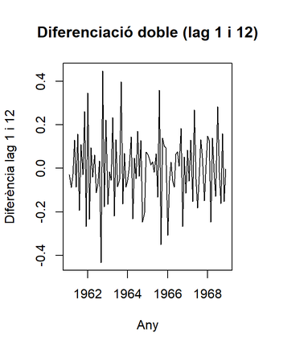
      <p class="caption">Figura 32: Sèrie temporal després de la diferenciació d'ordre 1 i 12</p>
    </div>
</div>

El gràfic resultant mostra una sèrie amb mitjana i variància estables i sense cap tendència o patró clar identificable. Això és indicatiu que la sèrie transformada és ara pràcticament estacionària: ha desaparegut tant la tendència com l’estacionalitat, i les fluctuacions semblen aleatòries al voltant del zero

### 9.3 Transformacions

#### 9.3.1 Canvi d'escala

Per a diagnosticar si la sèrie temporal té heterocedasticitat, podem utilitzar diversos mètodes gràfics i estadístics. En el nostre cas, farem el gràfic de la mitjana mòbil i la variància mòbil per observar si hi ha canvis en la dispersió al llarg del temps. Si la variància depèn del nivell de la sèrie, això indicaria heterocedasticitat.

Per a calcular les mitjanes i variàncies mòbils, fixem primer un període de finestra, per exemple, 12 mesos (un any):

```r
group_size <- 12
n <- length(sales)
num_groups <- floor(n / group_size)
```

Després, calculem la mitjana i la variància mòbils per a cada grup de 12 mesos amb un bucle:

```r
for (i in 1:num_groups) {
  group <- sales[((i-1)*group_size + 1):(i*group_size)]
  means[i] <- mean(group)
  vars[i] <- var(group)
}
```

Finalment, representem gràficament les mitjanes i variàncies mòbils:

```r
# Plot de la variància contra la mitjana de cada grup
ggplot(df, aes(x = mean, y = variance)) +
  geom_point(color = "blue", size = 2) +
  geom_smooth(method = "lm", se = FALSE, color = "red", linewidth = 1) +
  labs(title = "Mean-Variance plot",
       x = "Mitjana del grup",
       y = "Variància del grup") +
  theme_minimal()
```

El gràfic resultant és el següent:

<div class="image-row">
    <div class="image-column">
      
      <p class="caption">Figura 33: Gràfic de mitjana vs. variància mòbil</p>
    </div>
</div>

El gràfic Mean-Variance mostra que, a mesura que augmenta la mitjana de vendes dins de cada grup, la variància també creix. Aquesta relació positiva indica clarament que la variància no és constant al llarg del temps, sinó que depèn del nivell de la mitjana de la sèrie. Aquesta situació es coneix com a heteroscedasticitat i no és pròpia d’una sèrie estacionària. Quan s’observa aquest comportament, cal aplicar transformacions, com la logarítmica, per aconseguir estabilitzar la variància abans de continuar analitzant o modelitzant la sèrie.

També podem visualtizar els boxplots de les vendes anuals per veure si hi ha diferències en la dispersió de les vendes entre els diferents anys. Això ens pot donar una idea de si la variància canvia al llarg del temps. Ho fem amb la llibreria `ggplot2` i seguint el següent codi d'R:

```r
ggplot(df, aes(x = group, y = sales)) +
  geom_boxplot(fill = "lightblue") +
  labs(title = "Boxplot de vendes de cotxes per períodes d’1 any",
       x = "Grup anual",
       y = "Vendes") +
  theme_minimal()
```

El gràfic resultant és el següent:

<div class="image-row">
    <div class="image-column">
      
      <p class="caption">Figura 34: Boxplots de les vendes mensuals de cotxes per any</p>
    </div>
</div>

En dividir la sèrie de vendes mensuals de cotxes en grups d’un any i representar-ne el boxplot per cada període, s’observa que l’alçada de les caixes (IQR) augmenta progressivament a mesura que avança el temps. Aquesta major variabilitat en els grups amb valors mitjans més alts indica que la variància no és constant al llarg del temps. Per això, és necessari aplicar una transformació d’escala, com la logarítmica o com la de Box-Cox, per estabilitzar la variància abans de continuar amb l’anàlisi de la sèrie temporal.

Per aplicar la tranformació logarítmica, utilitzem la funció `log()` de R. Primer apliquem la transformació logarítmica a les vendes mensuals i després representem els boxplots anuals després de la transformació, que resulta en el següent gràfic:

<div class="image-row">
    <div class="image-column">
      
      <p class="caption">Figura 35: Boxplots de les vendes mensuals de cotxes per any després de la transformació logarítmica</p>
    </div>
</div>

Amb la gràfica del boxplot de log(vendes) per períodes d’un any, es pot concloure que la variància s’ha estabilitzat: les caixes (IQR) són molt més uniformes entre els diferents grups anuals, i la diferència d’alçada respecte als primers anys pràcticament ha desaparegut. Això vol dir que la transformació logarítmica ha estat efectiva per aconseguir variància aproximadament constant a la sèrie, fet que permet aplicar mètodes d’anàlisi estacionària amb més garanties de validesa estadística.

Sabem que hem d'aplicar la transformació de Box-Cox ja que tenim una variància no constant, i com volem arribar a una sèrie estacionària, és necessari mirar si ens cal fer la transformació.  Per aplicar la transfromació Box-Cox, utilitzem la funció `BoxCox.lambda()` de la llibreria `forecast` per trobar el millor valor de lambda per a la transformació Box-Cox. Primer estima el valor de lambda amb ``BoxCox.lambda()``, que ens retorna `0.9700565`, per tant sabem que pràcticament no hi ha una transformació significativa, ja que al ser un valor tant pròxim a 1, sabem que quasi no hi ha transformació (identitat).  Després apliquem la transformació amb la funció ``BoxCox()``, de que obtenim el següent gràfic de boxplots anuals després de la transformació:

<div class="image-row">
    <div class="image-column">
      
      <p class="caption">Figura 36: Boxplots de les vendes mensuals de cotxes per any després de la transformació Box-Cox</p>
    </div>
</div>

En el cas de la nostra base de dades de vendes mensuals de cotxes, la variància augmenta amb la mitjana: això es veu clarament en els boxplots anuals, on les caixes són més altes a mesura que les vendes creixen. Si només fem el logaritme, podem estabilitzar bastant la variància, però la transformació Box-Cox és millor perquè busca automàticament quin tipus de transformació s’adapta millor als nostres valors.
Això fa que la variància sigui encara més estable i la sèrie sigui més fàcil d’analitzar o de modelar després. Així, per les nostres dades, Box-Cox és la millor opció per aconseguir una sèrie més homogènia i adequada per a l’anàlisi de sèries temporals.

#### 9.3.2 Diferència estacional

Per saber primer si hem de fer servir la transformació de la diferència estacional, hem de començar fent els gràfics de ACF i PACF sense cap modificació prèvia, de manera que podem decidir cap a quina transformació fer per millorar el nostre model. El codi de R per fer aquests gràfics és:

```r
acf(car_sales_ts, ylim = c(-1, 1))
pacf(car_sales_ts, ylim = c(-1, 1))
```

Els gràfics resultants són els següents:

<div class="image-row">
    <div class="image-column">
      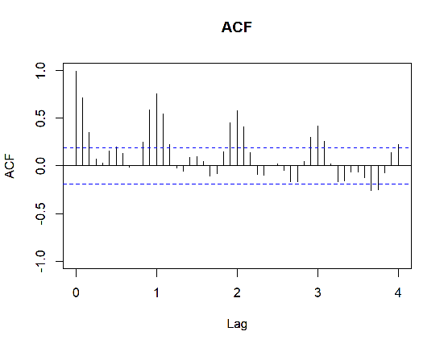
      <p class="caption">Figura 37: Funció d'autocorrelació inicial(ACF) </p>
    </div>
    <div class="image-column">
      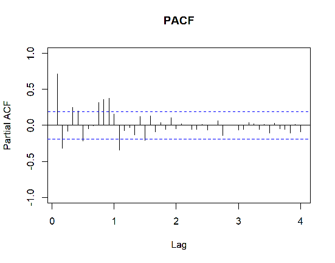
      <p class="caption">Figura 38: Funció d'autocorrelació parcial inicial (PACF)</p>
    </div>
</div>

Podem veure que el gràfic de ACF no està dins del límit establert, ni segueix el patró que hauria per poder ser vàlid, per tant, mirant aquest gràfic, podem dir que hem de fer una trasformació logarítmica, d'aquesta manera intentarem trobar una variància constant i intentar millorar el gràfic. Per tant, fem la transformació logarítmica i tornem a fer els gràfics amb el següent codi d'R:

```r
sales_log <- log(car_sales_ts)
acf(sales_log, ylim = c(-1, 1), main = "ACF de la sèrie log-transformada")
pacf(sales_log, ylim = c(-1, 1), main = "PACF de la sèrie log-transformada")
```

Els gràfics resultants despres de la transformació logarítmica són:
<div class="image-row">
    <div class="image-column">
      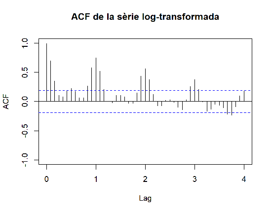
      <p class="caption">Figura 39: Funció d'autocorrelació transformació log(ACF) </p>
    </div>
    <div class="image-column">
      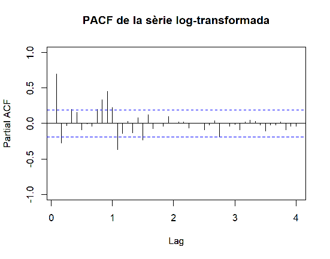
      <p class="caption">Figura 40: Funció d'autocorrelació parcial transformació log (PACF)</p>
    </div>
</div>

Veient aquests gràfics amb la transformació logarítmica, podem veure que la autocorrelació segueix sent molt elevada i que la tendència no és la correcta. Per tant, podem dir que la sèrie encara no és estacionària, com a mínim en mitjana, ja que és possible que ho sigui per variància. Per tant sabem que la transformació ha ajudat a estabilitzar la variància, però no ens ha ajudat amb la tendència ni la estacionalitat.
Per tant, la següent transformació que farem serà la diferenciació ordinària, per tal d'eliminar la tendència de la sèrie, i intentar fer la sèrie estacionària en mitjana.
El codi de R que fem servir és el següent:

```r
log_sales_diff1 <- diff(log_sales, lag = 1)       
acf(log_sales_diff1, ylim = c(-1, 1), main = "ACF diferenciació ordinària")
pacf(log_sales_diff1, ylim = c(-1, 1), main = "PACF diferenciació ordinària")
```

Els gràfics resultants després de la transformació són:
<div class="image-row">
    <div class="image-column">
      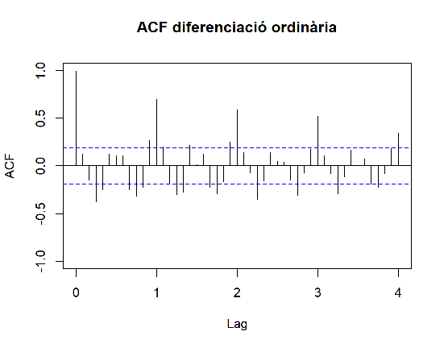
      <p class="caption">Figura 41: Funció d'autocorrelació transformació diferenciació ordinària (ACF) </p>
    </div>
    <div class="image-column">
      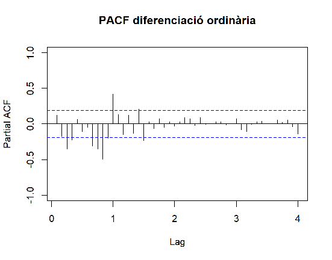
      <p class="caption">Figura 42: Funció d'autocorrelació parcial transformació diferenciació ordinària (PACF)</p>
    </div>
</div>

Després d’aplicar la diferenciació ordinària, podem veure un gràfic lleugerament més proper a la estacionarietat en la mitjana. Però, clarament encara podem veure una estacionalitat, tenim un pic molt pronunciat al lag 12, que en el nostre gràfic es representa com a 1. Això ens pot avisar d'una forta estacionalitat anual. Per tant, com a següent transformació, hem d'aplicar la diferenciació estacional. El codi per executar la següent transformació és:

```r
log_sales_diff1_diff12 <- diff(log_sales_diff1, lag = 12)   
acf(log_sales_diff1_diff12, ylim = c(-1, 1), main="ACF difernciació estacional")
pacf(log_sales_diff1_diff12, ylim = c(-1, 1), main="PACF diferenciació estacional")
```

Els gràfics resultants d'aquesta transformació són:
<div class="image-row">
    <div class="image-column">
      
      <p class="caption">Figura 43: Funció d'autocorrelació (ACF) després de la diferenciació estacional</p>
    </div>
    <div class="image-column">
      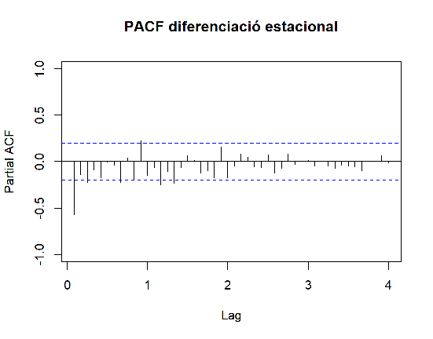
      <p class="caption">Figura 44: Funció d'autocorrelació parcial (PACF) després de la diferenciació estacional</p>
    </div>
</div>

Aquests gràfics ens mostren una clara diferència de patrons. En el gràfic d'ACF ja no tenim el pic que teniem anteriorment, per tant podem dir que hem eliminat la estacionalitat, i en aquest cas més concret, la anual. Podem veure que cap dels 2 gràfics té cap pic. Les dades estan dins de les barres de confiança. Per tant, ja podem dir que els nostres gràfics són vàlids per poder modelitzar.

### 9.4 Proposta de valors per el model

Primer, hem de comparar si el nostre model i els seus gràfics de ACF i PACF tenen similituds als gràfics de ACF i PACF dels models purs de AR(q) i MA(p).
Sabem que per tenir un model pur, els nostres gràfics hauríen de seguir els de la taula següent:

<div class="image-row">
    <div class="image-column">
      
      <p class="caption">Figura 45: Taula per identificar models purs.</p>
    </div>
</div>

Després de comparar podem veure que cap model ens ajuda, ja que no ens surt cap model pur. Tenim una similitud amb el model AR(p), però no la suficient com per considerar-la un model pur. Per tant, ara hem de buscar els components de ARIMA de manera independent.
Per tant, hem de proposar els ordres dels components del nostre model ARIMA. Primertament començarem amb q. Que sabem que és el nombre de termes amb mitjana mòbil. (MA) Aquesta primera dada la hem de buscar en el nostre gràfic de ACF.
Podem veure que el nostre gràfic té fins al tercer lag fora de les barres, per tant, una bona proposta és 3. **(MA(3))**
Ara busquem el segon component, que és p. Sabem que p és el nombre de termes autoregressius. (AR) Aquesta component la hem d'anar a buscar al nostre gràfic de PACF.
En el gràfic podem veure tres lags sortint de manera clara de les barres de confiança. Per tant, sabem que hi ha una autocorrelació parcial directa entre cada valor i els 3 primers lags. Per això la p = 3. I per tant, ens queda **(AR(3))**
Per escollir el paràmetre d, hem de contar les vegades que hem fet la diferenciació del nostre model. En el nostre cas, com l'hem fet 1 cop, el nostre paràmetre d serà 1.
Per escullir els paràmetres Q i P, hem de buscar barres als gràfics ACF/PACF respectivament que destaquin. I els haurem de dividir entre el nostre periode, en aquest cas 12, com que veiem que als 12 lags tenim una barra que destaca, podem dir que Q i P són 1. En el cas de D, com hem aplicat la diferenciació estacional 1 cop, sabem que serà 1.
Per tant, el nostre model de SARIMA ens queda (3, 1, 3), (1, 1, 1).
Ara hem de comprovar amb R si el nostre model és vàlid. Per fer-ho posem primer aquest codi:

```r
car_sales.arima <- arima(sales_log,
                         order    = c(3,1,3), 
                         seasonal = list(order = c(1,1,1), 
                                         period = 12), include.mean = FALSE)
```

Aquest codi ens farà el model, però per comprovar que són vàlids, hem de mirar si els radis dels coeficients superen tots 2, per tant farem el següent:

```r
ratios <- round(abs(car_sales.arima$coef/sqrt(diag(car_sales.arima$var.coef))),2)
ratios
ratios>2
```

Al fer el codi els resultats que ens dóna són:

```r
  ar1   ar2   ar3   ma1   ma2   ma3  sar1  sma1 
 0.75 10.84  1.24 10.07  7.06  7.03  3.11  2.52 
  ar1   ar2   ar3   ma1   ma2   ma3  sar1  sma1 
FALSE  TRUE FALSE  TRUE  TRUE  TRUE  TRUE  TRUE 
```

Ara el que hem d'anar fent és treure el coeficient més petit que sigui més pertit de 2. De manera que hem d'acabr amb un model on tots els nostres coeficients siguin positius. Després de fer aquest procés, el resultat final del nostre model és:

```r
 ma1 sar1 
8.85 3.81 
 ma1 sar1 
TRUE TRUE 
```

Ara per triar el nostre model, hem de fer el següent codi d'R:

```r
AIC(car_sales.arima)
AIC(car_sales.arima2)
```

Això ens retorna un valor, i el valor que sigui més petit sense contar el valor absolut serà el que farem servir com a model definitiu. El codi ens retorna:

```r
> AIC(car_sales.arima)
[1] -125.6338
> AIC(car_sales.arima2)
[1] -125.0084
```

Per tant, ens quedem amb el model següent. SARIMA(3, 1, 3)(1, 1, 1)

### 9.5 Validació del model

Ara per validar el nostre model, el primer que farem serà comprovar la nostra homoscedasticitat. Per fer-ho, farem un gràfic de residus temporals, de manera que veurem si els residues estan centrats en 0. SI veiem un patró, que no és el cas, sabem que el nostre model no capta tot el comportament de la sèrie. També fem un "scatter plot" per veure el valor absolut dels residus. Aquest gràfic tampoc ha de tenir cap tipus de patró. El codi d'R per arribar-hi és:

```r
resid <- mod_def$residuals
par(mfrow=c(1,2), mar=c(3,3,3,3))
plot(resid, main="Residuals")
abline(h = c(0 , -3*sd(resid), 3*sd(resid)), lty = c(1,3,3), col=c(1,4,4))
scatter.smooth(sqrt(abs(resid)), 
               main="Square Root of Absolute residuals",
               lpars = list(col=2))
```

Els gràfics resultants del nostre codi són:

<div class="image-row">
    <div class="image-column">
      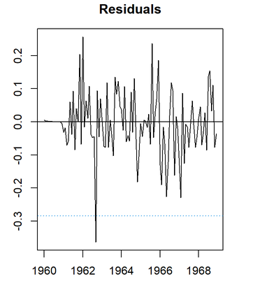
      <p class="caption">Figura 46: Residus temporals</p>
    </div>
    <div class="image-column">
      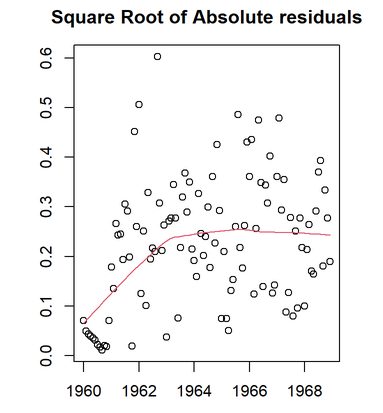
      <p class="caption">Figura 47: Scatter plot suavitzat de la arrel quadrada del valor absolut dels residus</p>
    </div>
</div>

A continuació, hem de mirar si els residus tenen una distribució normal, de manera que fem els següents gràfics en R per poder saber-ho:

```r
par(mfrow=c(1,2), mar=c(3,3,3,3))
qqnorm(resid)
qqline(resid,col=2,lwd=2)
hist(resid, breaks = 10, freq=F)
curve(dnorm(x, mean = mean(resid), sd = sd(resid)), col=2, add=T)
```

Els gràfics que ens surten són:

<div class="image-row">
    <div class="image-column">
      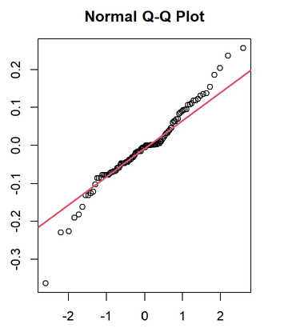
      <p class="caption">Figura 48: Q-Q plot dels residus en distribució normal</p>
    </div>
    <div class="image-column">
      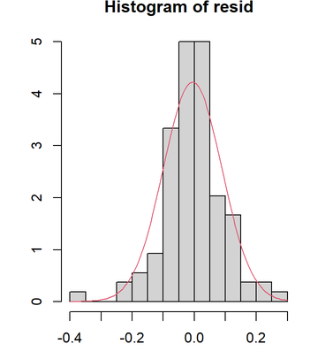
      <p class="caption">Figura 49: Histograma dels residus</p>
    </div>
</div>

Aquests gràfics, ens mostren que els residus, segueixen de manera general una distribució normal. Sense tenir en compte alguns outliers que hi poden haver, la resta segueixen la distribució desitjada.

EL següent que hem de fer és mirar si els nostres residus són independents. El codi per fer aquest gràfic en R és:

```r
tsdiag(mod_def, gof.lag = 15)
```

El gràfic resultant és:

<div class="image-row">
    <div class="image-column">
      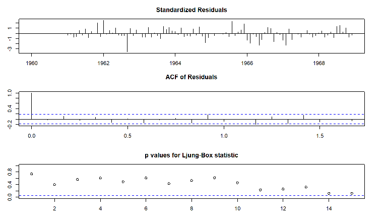
      <p class="caption">Figura 50: Validació de la independència dels residus</p>
    </div>
</div>

Per mirar-ho, ens hem de fixar amb lúltim gràfic. Podem veure que cap punt està per sota de la línia, per tant, cap punt té un valor inferior a 0,05. De manera que no podem rebutjar la nostra hipòtesi nula de: els residus són independents. Per tant, els nostres residus són independents.

Per tant, ja hem validat el nostre model.

### 9.6 Predicció

Ara que ja hem validat el nostre model, ens toca fer-lo servir per fer la predicció. Per poder fer un gràfic a on la veiem, farem servir el següent codi d'R:

```r
pred   <- predict(mod_def, n.ahead=24)
pr_log <- pred$pred
se_log <- pred$se

li_log <- pr_log - 1.96 * se_log # limit inferior log
ls_log <- pr_log + 1.96 * se_log # limit superior log

li <- ts(exp(li_log), start = 1969, freq=12)
pr <- ts(exp(pr_log), start = 1969, freq=12)
ls <- ts(exp(ls_log), start = 1969, freq=12)

# Grafic
par(mfrow=c(1,1))
ts.plot(car_sales_ts,
        li, ls, pr,
        lty  = c(1,2,2,1), 
        col  = c("black","blue","blue","red"),
        xlim = c(1960,1971))
```

El primer que fem en aquest codi és calcular les prediccions i l'error estàndar, i escollim una predicció de 2 anys/ 24 mesos. A continuació fem la sèrie logarítmica per els seus límits superiors i inferiors. Finalment, el que necessitem és la sèrie temporal inicial, no la que té una transformació logarítmica, per tant, desfem les transformacions en les 3 prediccions.
El nostre gràfic final és:

<div class="image-row">
    <div class="image-column">
      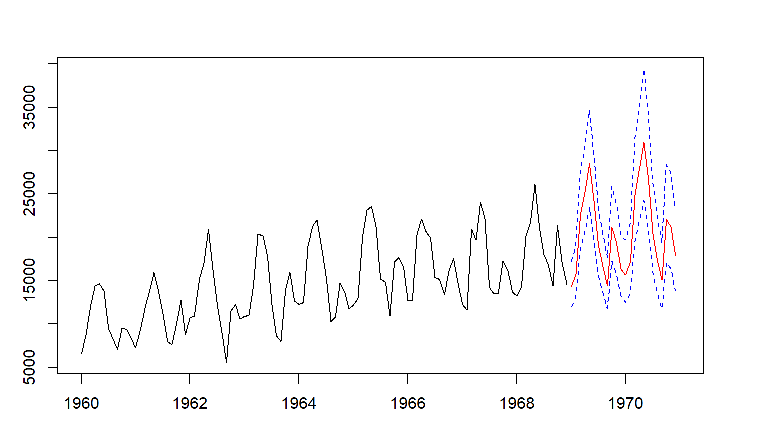
      <p class="caption">Figura 51: Predicció de la venda de cotxes durant 2 anys</p>
    </div>
</div>

Com podem veure, el nostre model ens fa una predicció, amb límits inferiors i superiors de les vendes de cotxes mensuals dels pròxims 2 anys.
